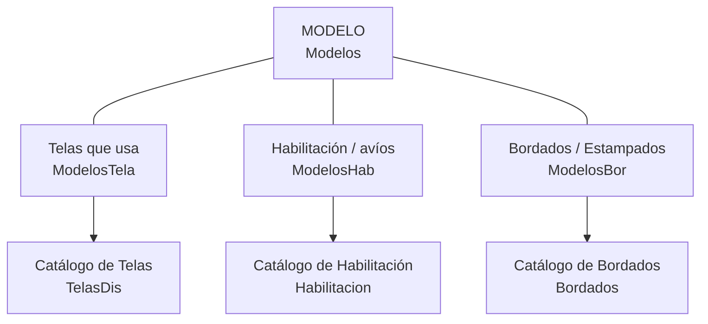

# 01 — Módulo MODELOS

> Primer paso de la secuencia natural del sistema: **MODELOS → PEDIDOS → PRODUCCIÓN**.
> Aquí se da de alta el catálogo de productos y, sobre todo, la **"receta" (lista de materiales)** de cada modelo, que después alimenta los costos y la producción.

Corresponde al **Menú 1 (MODELOS)** y sus submenús: Catálogos (5), Consultas (3) y Generador de códigos (Codigo). *(El submenú Promoda queda excluido — ver DECISIÓN D9.)*

---

## 1. Concepto central: el Modelo y su "receta"

Un **Modelo** es un producto (una prenda). No vive solo: tiene asociada una **lista de materiales (BOM)** dividida en tres partes:

En el formulario `Modelos`, estas tres partes aparecen como **subformularios** (`ModelosTela`, `ModelosHab`, `ModelosBor`). Es decir: capturas el modelo y, en la misma pantalla, le vas agregando sus telas, sus avíos y sus bordados con sus cantidades.

---

## 2. Modelo de datos

### Tabla maestra `Modelos`
| Campo | Significado |
|---|---|
| `IdModelos` | ID interno |
| `Modelo` | Código/nombre del modelo (clave de negocio) |
| `Descripcion` | Descripción |
| `Maquila` | Costo de maquila base del modelo |
| `IdTemporadas` | Temporada (catálogo `Temporadas`) |
| `Foto1` / `Foto2` | Nombre de archivo de las fotos |
| `Activo` | Activo / descontinuado |

### Receta — las 3 tablas de enlace
**`ModelosTela`** (telas del modelo):
| Campo | Significado |
|---|---|
| `IdModelos` | Modelo |
| `IdTelasDis` | Tela (del catálogo) |
| `CantTela` | Cantidad/consumo de tela |
| `bPreCosto` / `bProduccion` / `bCosto` | **Banderas de uso** (ver abajo) |

**`ModelosHab`** (habilitación / avíos): igual estructura, con `IdHabilitacion` y `CantHab` + las 3 banderas.

**`ModelosBor`** (bordados/estampados): `IdModelos`, `IdBordados`.

> ### 🔑 Las banderas `bPreCosto` / `bProduccion` / `bCosto`
> Cada componente de la receta puede marcarse para tres propósitos distintos:
> - **bPreCosto** → entra en el **pre-costeo** (estimación antes de producir).
> - **bProduccion** → se considera al **producir** (lo que realmente se manda pedir/usar).
> - **bCosto** → entra en el **costeo real** de la orden.
>
> Esto permite, por ejemplo, que una tela cuente para costear pero no se liste en producción, o viceversa. Es una decisión de diseño importante a conservar al modernizar.

### Catálogos que alimentan la receta
| Tabla | Es el catálogo de… | Campos clave |
|---|---|---|
| `TelasDis` | Telas/diseños | `TelaDis`, `Proveedor`, `Precio`, `ParaProduccion` |
| `Habilitacion` | Avíos/insumos | `Clave`, `Descripcion`, `Proveedor`, `Precio`, `Favorito`, `CantFav`, `Desactivado` |
| `Bordados` | Bordados y estampados | `Nombre`, `Puntadas`, `Precio`, `BorEst` (bordado o estampado), `Foto` |
| `Temporadas` | Temporadas | `Temporada` |
| `Estampadores` | Proveedores de estampado | `Corto`, `Nombre`, `Telefonos` |
| `EtiquetasM` | Etiquetas de marca | `EtiquetaM`, `Regalias` (% de regalías), `Activa` |

---

## 3. Las pantallas del módulo

### Catálogos (Menú 1.1)
| Opción | Formulario | Qué hace |
|---|---|---|
| Agregar/Modificar **Modelos** | `Modelos` | Alta del modelo + su receta (3 subforms) |
| Agregar/Modificar **Habilitación** | `Habilitacion` | Catálogo de avíos |
| Agregar/Modificar **Telas** | `TelasDis` | Catálogo de telas |
| Agregar/Modificar **Bordados/Estampados** | `Bordados` | Catálogo de bordados |
| Verificar y alta de modelos | `VerificarModelos` | Validación/alta masiva (nivel ≤45) |

### Consultas (Menú 1.2)
| Opción | Formulario |
|---|---|
| Ver lista completa de modelos | `TodosModelos` |
| Ver fotos de los modelos | `ModelosFotos` |
| Ver fotos de bordados/estampados | `BordadosFotos` |
| Generar listas de precios (por género) | `EscojerGenero` (nivel ≤45) |
| Consultar los PreCostos | `PreCostos` (nivel ≤45) |

### Otros
- **Generador de códigos de barra:** `Codigo`.
- ~~**Promoda**~~ (submenús 35/36): **excluido** — era para el cliente *Promoda*, ya sin uso (ver DECISIÓN D9).

---

## 4. Reglas de negocio detectadas (en el código del form `Modelos`)

1. **Convención de nombres de fotos:**
   - Botón "Mismo" → `Foto1 = [código del Modelo]`.
   - Botón "Mismo1" → `Foto2 = [código del Modelo] + "-P"`.
   - O sea, las fotos se **nombran igual que el código del modelo** (y la trasera con sufijo `-P`).
2. **Carga de imágenes desde el servidor:** las fotos se muestran con la función `DirFotos(...)`, que arma la ruta a partir de la constante `Ubica = "S:\AplicacionesMJD\Control\"`. Los bordados usan `DirBordados(...)`. Si no existe el archivo, muestra una imagen `NoFoto` (procedimientos `Foto1_Click`, `CargarFotos`).
3. **Alta de modelo:** al dar "Agregar" se va a registro nuevo, **oculta el subform de habilitación** hasta que se capture el código del modelo, y habilita el campo `Modelo`.
4. El campo **`Maquila`** en el modelo guarda un costo base de maquila que después se hereda/usa en las órdenes.

---

## 5. Cómo conecta con el resto del sistema

- **→ PEDIDOS:** al hacer un pedido (`PedidosDet.IdModelos`) se elige un modelo de este catálogo.
- **→ PRODUCCIÓN:** la orden (`Ordenes.IdModelos`) produce un modelo; su receta (`ModelosTela`/`ModelosHab` con bandera `bProduccion`) define los materiales.
- **→ COSTOS:** el pre-costeo y el costeo usan la receta filtrada por `bPreCosto` / `bCosto`, más precios de `TelasDis`, `Habilitacion`, `Bordados` y el % de `EtiquetasM.Regalias`.
- **→ INVENTARIO PT:** los modelos se clasifican para el inventario de producto terminado (`IPT_Modelos`).

---

## 6. Observaciones para la modernización

1. **Fotos por convención de nombre + ruta fija en `S:`.** Hoy la relación modelo↔foto es por nombre de archivo. En el sistema nuevo conviene guardar las imágenes como adjuntos referenciados en base de datos (o en un bucket), no por convención de nombre en una ruta de red.
2. **La "receta" (BOM) ya está bien modelada** con tablas de enlace y cantidades. Es una base sólida; solo hay que conservar el significado de las 3 banderas (`bPreCosto`/`bProduccion`/`bCosto`).
3. **`Activo`/`Desactivado`** en modelos y catálogos: importante para no perder histórico al "borrar" (se desactiva, no se elimina). Buen patrón a mantener.
4. **Regalías** viven en la etiqueta de marca (`EtiquetasM.Regalias`): es un costo que se calcula como % — documentarlo bien para el módulo de costos.

---

*Siguiente: [02 — Módulo PEDIDOS](02-Pedidos.md).*
