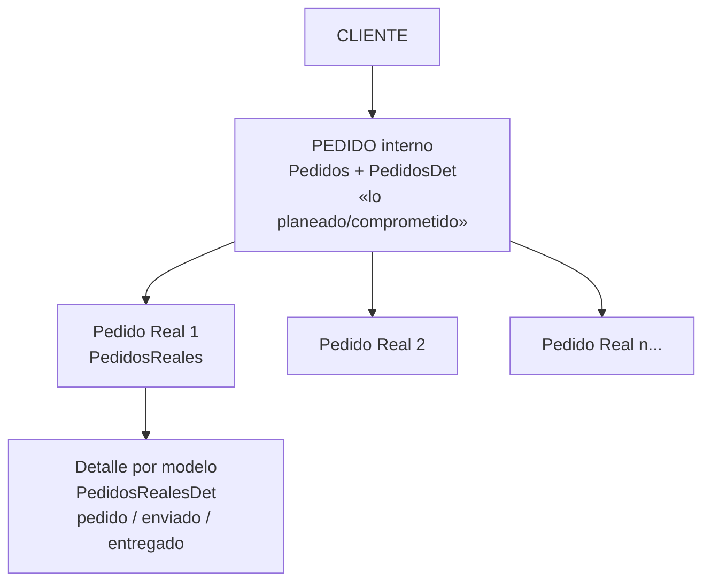

# 02 — Módulo PEDIDOS

> Segundo paso de la secuencia: **MODELOS → PEDIDOS → PRODUCCIÓN**.
> Aquí se registran los pedidos de los clientes (qué modelos, cuánto y a qué precio) y se da seguimiento a lo realmente liberado y entregado.

Corresponde al **Menú 2 (PEDIDOS)**: Consultar por mes, Agregar/Modificar pedidos, Clientes, y Pedidos Reales.

---

## 1. Dos niveles de pedido (concepto clave)

El sistema distingue entre el **Pedido interno** (la planeación/compromiso) y los **Pedidos Reales** (las liberaciones reales que va mandando el cliente):

- **Pedido interno** = lo que se acuerda con el cliente (por modelo, cantidad y precio). De aquí salen las **órdenes de producción**.
- **Pedido Real** = cada **liberación real** del cliente contra ese pedido, con su **CEDIS** (centro de distribución), fechas y cantidades **pedida / enviada / entregada**. Un pedido interno puede tener **varios** pedidos reales a lo largo del tiempo.

---

## 2. Modelo de datos

### `Pedidos` (encabezado del pedido interno)
| Campo | Significado |
|---|---|
| `IdPedidos` | ID interno |
| `IdClientes` | Cliente |
| `NumeroPed` | Número de pedido (consecutivo automático) |
| `FechaPedido` | Fecha del pedido |
| `FechaDe` / `FechaHasta` | Ventana de entrega comprometida |
| `FechaTela` | Fecha de tela |
| `FechaElaboracion` | Fecha de elaboración |
| `IdOrdCompra` | Orden de compra ligada |
| `EntregadoTienda` | Marca de entregado a tienda |
| `PedCancelado` | Pedido cancelado (cancelación suave) |
| `NoProducir` | Marcado para no producir |
| `IdEmpresas` | Empresa (multi-empresa) |

### `PedidosDet` (renglones del pedido)
| Campo | Significado |
|---|---|
| `IdPedidos` | Pedido al que pertenece |
| `IdModelos` | Modelo pedido (del catálogo MODELOS) |
| `CantPed` | Cantidad pedida |
| `Precio` | Precio pactado |
| `EntregadoParcial` | Cantidad ya entregada |
| `CantFalt` | Cantidad faltante |

### `PedidosReales` (liberación real del cliente)
| Campo | Significado |
|---|---|
| `IdPedidos` | Pedido interno al que se asocia |
| `NumPedReal` | Número del pedido real (del cliente) |
| `FechaPedPR` | Fecha del pedido real |
| `FechaInicioPR` / `FechaFinPR` | Ventana de entrega del pedido real |
| `FechaEntregadaReal` | Fecha en que se entregó |
| `Cedis` | Centro de distribución destino |
| `Apertura` | (apertura/temporada) |
| `IdUsuarios` / `FechaUsuario` | Auditoría: quién y cuándo lo capturó |

### `PedidosRealesDet` (detalle del pedido real, por modelo)
| Campo | Significado |
|---|---|
| `IdPedidosReales` | Pedido real |
| `IdPedidosDet` | Renglón del pedido interno (liga al modelo/precio) |
| `CantidadPR` | Cantidad del pedido real |
| `CantidadEnviada` | Cantidad enviada |
| `CantidadEntregadaReal` | Cantidad realmente entregada/aceptada |
| `Empaques` | Empaques |

### `Clientes`
Catálogo simple: `IdClientes`, `Cliente`, `Activo`.

---

## 3. Las pantallas del módulo

| Opción de menú | Formulario | Qué hace |
|---|---|---|
| Consultar Pedidos Por Mes | `PedidosPorMes` | Tablero de pedidos con filtros (mes, año, cliente, empresa, cancelados, entregados); botones para ver órdenes, compras y costos |
| Agregar/Modificar Pedidos | `Pedidos` (+ subform `PedidosDet`) | Alta y edición de pedidos y sus renglones |
| Agregar/Modificar Clientes | `Clientes` | Catálogo de clientes |
| Ver/Administrar Pedidos Reales | `PedidosRealesVer` (+ subform `PedidosRealesVerSub`) | Captura y consulta de pedidos reales (nivel ≤60) |

> **Nota de seguridad:** "Agregar/Modificar Pedidos" y "Clientes" requieren nivel ≤45 (Ventas); "Pedidos Reales" nivel ≤60. Además, los **importes/totales en $** se ocultan a niveles 45+ (ver doc 00).

---

## 4. Reglas de negocio detectadas (en el código)

1. **Número de pedido automático** (`AumentarNumPed`): toma `Max(NumeroPed) + 1`. Numeración consecutiva global.
2. **Cancelación suave** (`CancelarPed_Click`): no borra el pedido; pone `PedCancelado = True` y cambia las etiquetas a "Cancelado". Se conserva el histórico.
3. **Copiar un pedido completo** (`CopiarPed_Click` + `CopiarDetPed`): crea un pedido nuevo con el mismo cliente y fecha (NumeroPed arranca en 0), y permite **copiar renglón por renglón** los modelos/cantidades/precios del pedido anterior (preguntando uno por uno). Ideal para clientes que repiten surtido.
4. **Generar un Pedido Real** (`AgregarPedReal_Click`):
   - Valida que haya un **usuario activo** (`IdUsuarioACT`); si no, obliga a re-entrar al sistema.
   - Inserta el encabezado en `PedidosReales` con el usuario y fecha (auditoría).
   - **Replica automáticamente** un renglón en `PedidosRealesDet` por cada renglón del pedido interno (`PedidosDet`).
   - Advierte que **es irreversible** ("es imposible borrarlo").

---

## 5. Cómo conecta con el resto del sistema

- **← MODELOS:** cada renglón (`PedidosDet.IdModelos`) elige un modelo del catálogo.
- **→ PRODUCCIÓN:** cada renglón del pedido (`PedidosDet`) se convierte en una **Orden** (`Ordenes.IdPedidosDet`). Ver [03 — Producción](03-Produccion.md).
- **→ Entregas:** las entregas al cliente (`EntregasCliente`) van descontando contra `EntregadoParcial`/`CantFalt`, y los pedidos reales registran lo enviado/entregado.
- **→ COSTOS:** desde `PedidosPorMes` se consultan costos y márgenes por pedido.

---

## 6. Observaciones para la modernización

1. **Numeración por `Max()+1`:** funciona, pero en multiusuario puede generar **números duplicados** si dos personas dan de alta a la vez (no hay bloqueo/secuencia atómica). En el sistema nuevo debe ser una **secuencia/autonumérico** real, por empresa.
2. **Pedido interno vs Pedido Real** es un modelo correcto para relación con cadenas/tiendas (forecast vs órdenes de compra reales por CEDIS). Vale la pena conservarlo y reforzar el seguimiento pedido→enviado→entregado.
3. **Cancelación e inactivación suaves** (`PedCancelado`, `NoProducir`, `Activo`): buen patrón, mantener.
4. **Auditoría** ya presente en pedidos reales (usuario + fecha). Conviene extenderla a todas las tablas en la versión nueva.
5. **Copiado interactivo uno-por-uno** (con un MsgBox por renglón) es lento; en la app nueva puede ser una selección múltiple con un clic.

---

*Siguiente: [03 — Módulo PRODUCCIÓN](03-Produccion.md) (ya documentado).*
