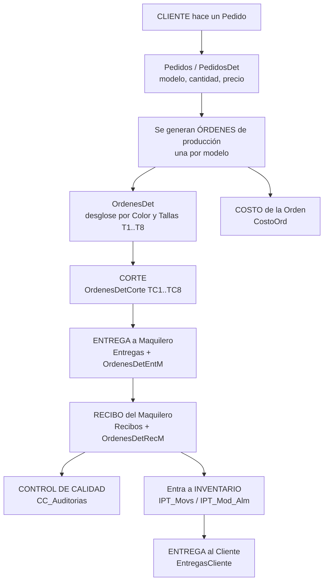

# 01 — Flujo de Producción

Este es el **corazón del negocio**: cómo un pedido de cliente se convierte en prenda producida y entregada.

## Diagrama general



## Las entidades (tablas) y su jerarquía

```
Pedido (Pedidos)
  └─ Renglón de pedido (PedidosDet)      → un modelo + cantidad + precio
       └─ Orden de producción (Ordenes)   → se fabrica ese modelo
            ├─ Detalle por color/talla (OrdenesDet)        T1..T8
            ├─ Corte (OrdenesDetCorte)                     TC1..TC8
            ├─ Entrega a maquila (Entregas + OrdenesDetEntM) TC1..TC8
            ├─ Recibo de maquila (Recibos + OrdenesDetRecM)  TC1..TC8
            └─ Costo (CostoOrd)
```

---

## Paso 1 — Pedido del cliente

**Pantallas:** `Pedidos`, `PedidosDet` (subformulario), variantes `Pedidos1`, `Pedidos2`, `PedidosPorMes`.

**Tabla `Pedidos`** (encabezado):
| Campo | Significado |
|---|---|
| `IdPedidos` | ID del pedido |
| `IdClientes` | Cliente |
| `NumeroPed` | Número de pedido |
| `FechaPedido` | Fecha en que se levanta |
| `FechaDe` / `FechaHasta` | Ventana de entrega comprometida |
| `FechaTela` | Fecha de tela |
| `IdOrdCompra` | Orden de compra ligada |
| `PedCancelado` | Pedido cancelado (sí/no) |
| `NoProducir` | Marcado para no producir |
| `FechaElaboracion` | Fecha de elaboración |
| `IdEmpresas` | Empresa |

**Tabla `PedidosDet`** (renglones):
| Campo | Significado |
|---|---|
| `IdPedidos` | A qué pedido pertenece |
| `IdModelos` | Modelo pedido |
| `CantPed` | Cantidad pedida |
| `Precio` | Precio pactado |
| `EntregadoParcial` | Cantidad ya entregada |
| `CantFalt` | Cantidad faltante por entregar |

**Regla de negocio detectada — Copiar pedido anterior** (`CopiarDetPed`):
El sistema permite **clonar los renglones de un pedido previo**. Recorre los `PedidosDet` del pedido anterior (`IdPedidosAnt`) y, modelo por modelo, pregunta al usuario si lo copia (modelo, cantidad, precio) al nuevo pedido. Útil para clientes que repiten surtido.

---

## Paso 2 — Orden de producción

**Pantallas:** `Ordenes`, `OrdenesDet` (subformulario), `OrdenVer`, `OrdenVerOrd`, `OrdImp` (impresión).

Cada **renglón de pedido** (`PedidosDet`) se convierte en una **Orden** (`Ordenes`). La orden ya trae mucho detalle de fabricación:

**Tabla `Ordenes`** (campos clave):
| Campo | Significado |
|---|---|
| `Numero` | Número de orden |
| `IdPedidosDet` | Renglón de pedido que la origina |
| `IdModelos` | Modelo a producir |
| `IdMaquileros` | Maquilero asignado |
| `IdEtiquetasM` | Etiqueta/marca |
| `IdClientes` | Cliente |
| `IdTelasDis` | Tela/diseño asignado |
| `Fecha` / `FechaEntrega` | Fechas de la orden |
| `Tallas` | Curva de tallas usada |
| `MaquilaOrd` | Costo de maquila de la orden |
| `NoCost` | No costear |
| `OrdCancelada` / `MotivoCancelada` | Cancelación |
| `IdCP_Articulos` | Artículo de costos/procesos |
| `FechaInicioRC` … `FechaEntregaRC`, `FechaProg`, `EnRiesgo`, `RC_Viva`, `SI_RC` | Campos del módulo de **Reporte de Control (RC)** y programación |
| `Pagada` | Si ya se pagó al maquilero |
| `Composicion` | Composición de la prenda |

**Tabla `OrdenesDet`** (desglose por color y talla):
| Campo | Significado |
|---|---|
| `IdOrdenes` | Orden |
| `Color` | Color de esa línea |
| `T1 … T8` | Cantidades por talla |

> El subformulario `OrdenesDet` muestra una columna calculada `Total = T1+T2+…+T8`.
> Tiene utilidades para **copiar** detalles y crear nuevos renglones (`NuevoReg`, `Copiar_Click`).

---

## Paso 3 — Corte

**Pantallas:** `OrdDetCorte`, `OrdDetCorteSub`, `OrdDetCorteCon` (consulta), `CorteSemanal`.

**Tabla `OrdenesDetCorte`:**
| Campo | Significado |
|---|---|
| `IdCorte` | Evento de corte (quién/cuándo cortó — tabla `Corte`/`Cortadores`) |
| `IdOrdenesDet` | A qué línea de la orden corresponde |
| `TC1 … TC8` | Cantidades **cortadas** por talla |

Aquí se registra cuánto se cortó realmente de cada talla. Igual que en orden, se calcula `Total = TC1+…+TC8`.

---

## Paso 4 — Entrega a maquilero

**Pantallas:** `OrdDetEntM` (entrega a Maquila), `OrdDetEntA` (entrega a Almacén), `OrdDetEntregas`.

**Tabla `Entregas`** (encabezado de la entrega que SALE hacia el maquilero):
| Campo | Significado |
|---|---|
| `IdOrdenes` | Orden |
| `IdMaquileros` | Maquilero que recibe el material |
| `Fecha` / `FechaEntregaM` | Fechas |
| `Cantidad` | Total entregado |
| `PrecioPactado` | Precio de maquila pactado |
| `Consecutivo` | Folio |

**Tabla `OrdenesDetEntM`** (desglose por talla de lo entregado): `IdEntregas`, `IdOrdenesDet`, `TC1…TC8`.

> Nota: existen variantes **M** (Maquila) y **A** (Almacén) tanto en entregas como en recibos
> (`OrdenesDetEntM`/`OrdenesDetEntA`, `OrdenesDetRecM`/`OrdenesDetRecA`).

---

## Paso 5 — Recibo del maquilero (¡y entrada a inventario!)

**Pantallas:** `ProcesoRecibo`, `ProcesoReciboEst`, `ReciboMaqDet`, `RecibosSemanalesMaq`.

**Tabla `Recibos`** (lo que el maquilero ENTREGA terminado):
| Campo | Significado |
|---|---|
| `IdOrdenes` | Orden |
| `Fecha` | Fecha del recibo |
| `Cantidad` | Total recibido |
| `IdMaquileros` | Maquilero |
| `TipoPrendas` | 1=Primeras, 2=Segundas (calidad) |
| `Inventariado` | Si ya se cargó a inventario |

**Tabla `OrdenesDetRecM`** (desglose por talla recibido): `IdRecibos`, `IdOrdenesDet`, `TC1…TC8`.

**Regla de negocio detectada — El recibo alimenta el inventario** (`MeterInventario`):
Cuando se procesa un recibo, el sistema:
1. Valida que haya **fecha** y **cantidad**.
2. Inserta un movimiento en **`IPT_Movs`** (tipo de movimiento `2`, entrada `EnSa=1`), ligado al maquilero, almacén (`TipoPrendas`), usuario y recibo.
3. Busca el modelo de inventario (`IPT_Modelos`) ligado a esa orden y su registro de existencia por almacén (`IPT_Mod_Alm`).
4. Inserta el detalle del movimiento en **`IPT_MovsDet`**.
5. **Suma la cantidad a la existencia**: `UPDATE IPT_Mod_Alm SET Existencia = Existencia + Cantidad`.
6. Marca el recibo como `Inventariado = True`.

> 🔗 Aquí es donde el **flujo de producción se conecta con el módulo de Inventario (IPT)**.
> Las "Primeras" y "Segundas" (`TipoPrendas`) se manejan como **almacenes distintos**.

---

## Paso 6 — Control de Calidad

**Pantallas:** `CC_AltaAuditorias`, `CC_MeterAuditorias(Det)`, `CC_ConsultaAuditorias`, `CC_ConsulAuditMaq`.

Sobre lo recibido se hacen **auditorías de calidad** (`CC_Auditorias` / `CC_AuditoriasDet`, catálogo `CC_Catalogo`). Es lo que separa "Primeras" de "Segundas".

---

## Paso 7 — Entrega al cliente

**Tabla `EntregasCliente`:**
| Campo | Significado |
|---|---|
| `IdOrdenes` | Orden |
| `Fecha` | Fecha de entrega al cliente |
| `Cantidad` | Cantidad entregada |
| `NoPedido` | Referencia de pedido |

Esto es lo que va alimentando `PedidosDet.EntregadoParcial` y `CantFalt` (faltante).

---

## Paso paralelo — Costo de la orden

**Tabla `CostoOrd`** (un costeo por orden):
| Campo | Significado |
|---|---|
| `TelaCost` | Costo de tela |
| `HabCost` | Costo de habilitación |
| `BordCost` | Costo de bordado |
| `MaquilaCost` | Costo de maquila |
| `RegaliasCost` | Regalías |
| `Otros` / `DescOtros` | Otros costos + descripción |
| `Costo` | Costo total |

> Se detalla a fondo en el documento **06 — Costos y EDR**.

---

## Submódulo — Órdenes de Compra (Menú 3.5)

Registra las **compras a proveedores** (telas, avíos, servicios), casi siempre **relacionadas a una o varias órdenes de producción**. Es **indispensable**.

**Tabla `OrdCompra`** (encabezado):
| Campo | Significado |
|---|---|
| `IdProveedor` | Proveedor (`Proveedores`) |
| `NumCompra` | Número de orden de compra |
| `Fecha` / `FechaEntrega` / `FechaRecibido` | Fechas |
| `EntregaEn` | Dónde se entrega |
| `Parcial` | Entrega parcial |
| `Totales` | Importe total |
| `FacturasAmparadas` | Facturas que ampara |
| `CorrespondeA` / `Estatus` | A qué corresponde / estatus |
| **`Autorizado`, `IdUsuAutorizado`, `FechaAutorizado`** | **Flujo de autorización** (acceso #8) |
| `Cancelado`, `CanceladoMotivo`, `IdUsuCancelado` | Cancelación con motivo y responsable |
| `IdUsuarios`, `IdEmpresas` | Quién la hizo, empresa |

**Tabla `OrdCompraDet`** (renglones): `Cantidad`, `Unidad`, `Descripcion`, `Precio`.

**Tabla `OrdCom-Ord`** (relación **N:N**): liga una orden de compra con **varias órdenes de producción** (y una orden puede tener varias compras).

**Pantallas (Menú 3.5):** `OrdCompra` (hacer), `OrdCompraVer` (consultar/imprimir), `Proveedores` (catálogo), `OrdCompraOrdenes` (compras por orden de producción), `OrdCompraProceso` (autorizar).

> ✅ Buen diseño ya presente: **autorización** (quién y cuándo) y **cancelación auditada** (motivo + usuario).

---

## Submódulo — Notas de Salida (Menú 3.4)

Documenta **todo lo que se manda con los maquileros aparte de las prendas** (avíos, insumos, trazos, etc.). Va relacionada a **un maquilero** y a **una o varias órdenes de producción**. (11,459 renglones registrados → muy usado.)

**Tabla `Notas`** (encabezado): `NumNota`, `FechaElaboracion`, `FechaEnvio`, `IdMaquileros`, `IdUsuarios`, `Observaciones`.

**Tabla `NotasDet`** (renglones): `IdOrdenes` (orden a la que aplica) + `Descripcion` (**texto libre** de lo que se manda).

Ejemplo real de una nota:
> *"Cierre Nycast Rojo de 15cm fijo 620 pzas. Trazos 64901C1, C2…"*
> *"Elástico de 1½" 15 Rollos (750 mts), Jareta Poliéster Rojo 7 Rollos…"*

**Pantallas (Menú 3.4):** `Notas` (hacer), `NotasVer` (consultar/imprimir), `NotasOrd` (notas por orden de producción).

**Propósito:** poder **visualizar todo lo que se le entrega al maquilero** además de las prendas (todos los avíos).

> 🟡 **Mejora clave:** hoy `NotasDet.Descripcion` es **texto libre**, así que no se puede analizar (cuánto elástico, cuántos cierres se enviaron, ni descontarlo del inventario de avíos). En CONTROL v2 conviene **estructurar** las notas: ligar cada renglón al **catálogo de Habilitación** con cantidad y unidad, para tener trazabilidad e impacto en inventario.

---

## Observaciones para la modernización

1. **Modelo "ancho" de tallas (T1..T8 / TC1..TC8).** Hoy las tallas son 8 columnas fijas. → 🟢 **DECISIÓN D4:** tallas **ilimitadas** (normalizar a `detalle(linea, talla, cantidad)`) y el **inventario de PT por modelo × color × talla × almacén**. Modelo de datos objetivo en [DECISIONES.md](DECISIONES.md).
2. **Lógica de negocio metida en los botones.** Reglas críticas (como cargar inventario al recibir) viven en eventos de formularios con `INSERT/UPDATE` directos por SQL. Al migrar, esto debe pasar a **servicios/funciones de backend** con transacciones (hoy no hay transacción: si falla a la mitad, el inventario puede quedar inconsistente).
3. **"Primeras/Segundas" como almacenes.** El campo `TipoPrendas` mezcla calidad y almacén. Vale la pena modelarlo explícito.
4. **Duplicación M/A** (Maquila/Almacén) en entregas y recibos: revisar si ambas siguen en uso o una quedó obsoleta.
5. **Trazabilidad por talla completa**: el sistema ya rastrea cantidades por talla en cada etapa (pedido→corte→entrega→recibo). Es una base excelente para reportes de mermas y avance que conviene conservar.

---

*Siguiente: documentar el Modelo de Datos completo y el Módulo de Costos.*
