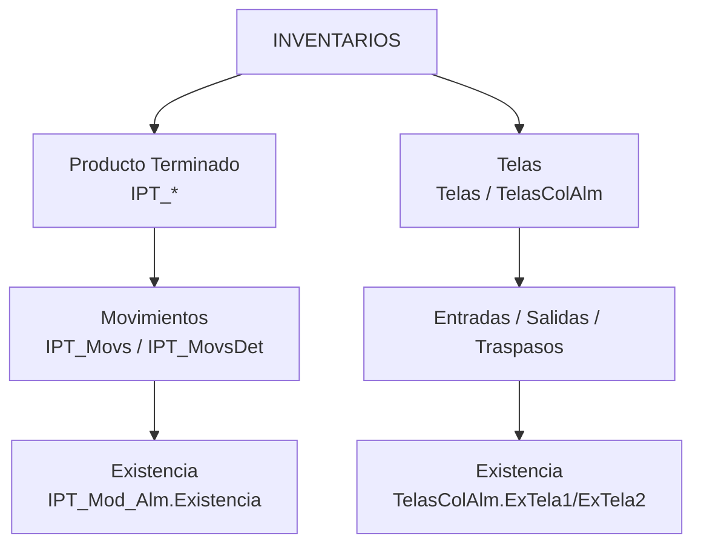

# 04 — Módulo INVENTARIOS

> Corresponde al **Menú 4 (INVENTARIOS)**. Son **dos inventarios independientes**, ambos basados en movimientos (kardex):
> - **Producto Terminado (PT / IPT)** — prendas ya producidas.
> - **Telas** — materia prima.



---

# A) Inventario de Producto Terminado (IPT)

Lleva el stock de prendas terminadas, por **modelo** y por **almacén**. Aquí es donde **aterriza el recibo del maquilero** (ver [03 — Producción §5](03-Produccion.md)).

## A.1 Modelo de datos

| Tabla | Rol | Campos clave |
|---|---|---|
| `IPT_Modelos` | Ítem de PT (un modelo clasificado para inventario) | `NumMod`, `IdOrdenes`, `Ubicacion`, género, etiqueta, `IdIPT_TipoProd`, `IdIPT_TipoPiezas`, `MarcaImpresa`, cliente |
| `IPT_Almacenes` | Almacenes de PT | `Almacen`, `TipoAlmacen` |
| `IPT_Mod_Alm` | **Existencia** por modelo × almacén | `IdIPT_Modelos`, `IdIPT_Almacenes`, `Existencia` |
| `IPT_Movs` | Encabezado de movimiento | `Fecha`, `IdIPT_TipoMov`, `EnSa` (1=entra/0=sale), `IdMaquileros`, `IdIPT_Almacenes`, `IdUsuarios`, `IdRecibos` |
| `IPT_MovsDet` | Detalle del movimiento | `IdIPT_Mod_Alm`, `CantMov` |
| `IPT_TiposMov` | Tipos de movimiento | `TipoMov`, `TipoEnSa` |
| Catálogos | `IPT_Generos`, `IPT_TipoProd`, `IPT_TipoPiezas` | clasificación |

> **"Primeras" y "Segundas" son almacenes** (`IPT_Almacenes`), no un atributo de la prenda. Por eso el recibo pregunta `TipoPrendas` y lo usa como almacén destino.

## A.2 Cómo se mueve el stock

Todo movimiento sigue el patrón **encabezado + detalle + actualización de existencia**:
1. Se inserta `IPT_Movs` (tipo, entrada/salida, fecha, almacén, usuario).
2. Se inserta `IPT_MovsDet` con la cantidad (`CantMov`) por modelo.
3. Se actualiza el saldo: `UPDATE IPT_Mod_Alm SET Existencia = Existencia ± CantMov`.

- **Entradas automáticas:** al procesar un recibo de maquila → movimiento tipo entrada (`EnSa=1`) que suma a la existencia (procedimiento `MeterInventario`, ver doc 03).
- **Traspasos entre almacenes:** form `IPT_Mov` → abre `IPT_MovTransfer` con almacén origen y destino (resta en uno, suma en otro).
- **Movimientos manuales:** form `IPT_Movimientos` (alta/modificación de entradas, salidas y traspasos).

## A.3 Pantallas (Menú 4.1)
| Submenú | Opción | Formulario |
|---|---|---|
| Alimentar (32) | Alta de nuevos modelos | `IPT_AltaModelos` |
| | Movimientos (entrada/salida/traspaso) | `IPT_Mov` |
| | Clasificar los modelos | `IPT_Modelos` |
| | Alta de almacenes | `IPT_AltaAlmacen` |
| Consultas (33) | Existencias | `IPT_Exis` |
| | Movimientos por modelo | `IPT_MovsSaldo` |
| | Movimientos por folio | `IPT_MovsLista` |
| (30) | Revisión: suma de movimientos vs existencia | `IPT_Revision` |

> `IPT_Revision` existe para **cuadrar** la suma de movimientos contra la existencia almacenada → señal de que el saldo a veces se descuadra (ver observaciones).

---

# B) Inventario de Telas

Lleva el stock de **materia prima** por tela, color y almacén.

## B.1 Concepto clave: telas de **dos componentes**

Una tela puede tener **dos partes** (ej. cuerpo + puño/cardigan). Por eso casi todo se registra **por duplicado**:
- En el catálogo, `Telas.Texto1` y `Telas.Texto2` etiquetan los dos componentes (ej. **"Felpa"** y **"Cardigan"**).
- Las existencias, entradas y salidas guardan dos cantidades: `…1` y `…2`.
- Si una tela **no** tiene segundo componente, el sistema **oculta** los campos `…2` (lo controla el evento `Form_Current` revisando si hay "Cardigan").

## B.2 Modelo de datos

| Tabla | Rol | Campos clave |
|---|---|---|
| `Telas` | Catálogo de telas | `Nombre`, `Descripcion`, `Medida`, `Texto1`/`Texto2` (componentes), `PrecioSugerido`, `IdTelasCategorias`, `Activa` |
| `TelasColores` | Tela × color (con precio) | `IdTelas`, `Color`, `Precio` |
| `TelasColAlm` | **Existencia** por color × almacén | `IdTelasColores`, `IdAlmacenes`, **`ExTela1`**, **`ExTela2`** |
| `TelasCategorias` | Categorías de tela | `CategoriaTela` |
| `Almacenes` | Almacenes de tela | `Almacen`, `Activo` |
| `Entradas` / `EntradasDet` | Compras/entradas (con factura) | `Factura`, `IdTela`; det: `IdTelasColAlm`, `TelaEnt1`, `TelaEnt2`, `Peso` |
| `Salidas` / `SalidasDet` | Salidas **hacia una orden de producción** | `IdOrdenes`, `IdTela`; det: `IdTelasColAlm`, `TelaSal1`, `TelaSal2` |
| `Notas` / `NotasDet` | Notas de salida a maquileros | `NumNota`, `IdMaquileros`; det liga a `IdOrdenes` |

## B.3 Cómo se mueve el stock

La existencia (`ExTela1`/`ExTela2`) se va **sumando/restando en la misma pantalla** conforme capturas:
```
Al capturar una entrada:  ExTela1 = ExTela1 + TelaEnt1   (y ExTela2 += TelaEnt2)
Al capturar una salida:   ExTela1 = ExTela1 − TelaSal1   (…)
```
(Lo hacen los eventos `GotFocus`/`LostFocus` de los campos de cantidad.)

- **Entradas:** `QueAlmacenEntrada` → captura factura y cantidades (form `EntradasSub`).
- **Salidas:** `QueAlmacenSalida` → la tela sale **asociada a una orden de producción** (`Salidas.IdOrdenes`).
- **Traspasos entre almacenes:** `ITelas_QueAlmTransfer`.
- **Alta de telas:** `AgregarTelas` (+ subform).

## B.4 Pantallas (Menú 4.2)
| Submenú | Opción | Formulario |
|---|---|---|
| Alimentar (12) | Agregar/Modificar Telas | `AgregarTelas` |
| | Entradas de Tela | `QueAlmacenEntrada` |
| | Salidas de Tela | `QueAlmacenSalida` |
| | Transferencia entre almacenes | `ITelas_QueAlmTransfer` |
| | Alta de almacenes | `AltaAlmacenes` |
| Consultas (13) | Existencia de telas | `Existencia` |
| | Movimientos por tela y color | `Movimientos` |
| | Entradas por facturas | `TodosMovEnt` |
| | Salidas por corte y modelo | `TodosMovSal` |
| | Salidas por notas | `TodosSalNotas` |

---

## Cómo conecta con el resto del sistema

- **PT ← Producción:** el recibo del maquilero **suma** al inventario de PT (entrada automática).
- **Telas → Producción:** la tela **sale** del inventario asociada a la orden que la consume (`Salidas.IdOrdenes`), y se envía a maquila vía **Notas**.
- **Telas ← Órdenes de compra:** las entradas se registran con su **factura** del proveedor.
- **Catálogos:** las telas del inventario son las mismas que se asignan en la receta del modelo (`ModelosTela` → `TelasDis`).

---

## Observaciones para la modernización

1. **⚠️ Actualización de existencia por eventos de foco (frágil).** En telas, el saldo se ajusta en `GotFocus`/`LostFocus` (resta al entrar al campo, suma al salir). Si un evento no dispara (cierre abrupto, navegación inesperada), **la existencia se descuadra**. La pista es que existe `IPT_Revision` para recuadrar. → En el sistema nuevo, la existencia debe ser **siempre el resultado de sumar los movimientos** (kardex con transacciones), nunca un contador editado a mano.
2. **Dos inventarios con la misma mecánica** (movimiento → existencia). Se pueden **unificar** bajo un solo motor de inventario configurable (tipos de ítem: PT y Tela).
3. **Telas de dos componentes** (Felpa/Cardigan): → 🟢 **DECISIÓN D5:** un lote puede traer **N telas acompañantes** (no solo 2), ligadas por **lote/color** (el cardigan llega del mismo lote para que casen los colores). Modelo objetivo en [DECISIONES.md](DECISIONES.md).
4. **Inventario de PT sin talla/color:** hoy `IPT_Mod_Alm` guarda existencia por modelo × almacén. → 🟢 **DECISIÓN D4:** debe ser por **modelo × color × talla × almacén**.
4. **Sin transacciones:** las inserciones de movimiento + actualización de saldo deberían ser **atómicas** (si falla a la mitad, queda inconsistente).
5. **Trazabilidad ya presente:** entradas con factura, salidas ligadas a orden, notas a maquilero, usuario en cada movimiento. Excelente base para mantener.

---

*Siguiente: [05 — Indicadores (IP / Almacén)](05-Indicadores.md).*
