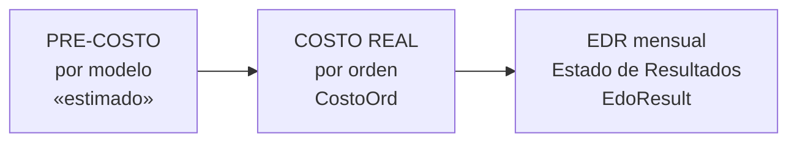

# 06 — Módulo COSTOS y EDR

> Corresponde al **Menú 6 (COSTOS Y EDR)**, restringido a **nivel ≤30 (Directivo)**.
> Es el módulo financiero: cuánto cuesta producir y cuánto se gana. Se apoya en las recetas de [MODELOS](01-Modelos.md) y en las órdenes de [PRODUCCIÓN](03-Produccion.md).

> ⚠️ **ESTADO ACTUAL (nota del dueño):** este módulo **no está en uso activo desde hace tiempo** porque tiene varios detalles/problemas pendientes. Esta documentación describe cómo funciona **hoy en el código** (referencia para el rediseño); el dueño aportará sus mejoras antes de reconstruirlo. Las decisiones ya tomadas se marcan como **🟢 DECISIÓN PARA EL SISTEMA NUEVO**.

---

## 1. Tres niveles de costeo



| Nivel | Qué responde | Tabla / Form |
|---|---|---|
| **Pre-costo** | ¿Cuánto *estimo* que cuesta este modelo? | `PreCostos` (usa la receta) |
| **Costo real** | ¿Cuánto costó *de verdad* producir esta orden? | `CostoOrd` |
| **EDR** | ¿Cuánto gané en el mes/año? | `EdoResult` + `EdoResultDet` |

---

## 2. Pre-costo por modelo (`PreCostos`)

Pantalla espejo del form `Modelos`, pero enfocada a costear. Tiene los 3 subformularios de la receta: `PreCostosTela`, `PreCostosHab`, `PreCostosBor`.

- Toma los componentes de la receta **marcados con `bPreCosto`** (ver [MODELOS §2](01-Modelos.md)).
- Multiplica cada cantidad (`CantTela`, `CantHab`) por el precio del catálogo (`TelasDis.Precio`, `Habilitacion.Precio`, `Bordados.Precio`).
- Suma el costo de maquila base (`Modelos.Maquila`) y las regalías (`EtiquetasM.Regalias`).
- Resultado: un **costo estimado del modelo** antes de producir. Accesible también desde MODELOS (nivel ≤45).

---

## 3. Costo real por orden (`CostoOrd`)

Un costeo por **orden de producción**. Form `CostoOrd` + subform `CostoOrdSub`.

**Tabla `CostoOrd`:**
| Campo | Significado |
|---|---|
| `IdOrdenes` | Orden costeada |
| `TelaCost` | Costo de tela |
| `HabCost` | Costo de habilitación |
| `BordCost` | Costo de bordado/estampado |
| `MaquilaCost` | Costo de maquila |
| `RegaliasCost` | Regalías (de la etiqueta de marca) |
| `Otros` / `DescOtros` | Otros costos + descripción |
| `Costo` | **Costo total** de la orden |
| `Observaciones` | Notas |

**Composición del costo total.** El campo `Costo` **suma los 6 componentes** (no solo la tela):
```
Costo = TelaCost + HabCost + BordCost + MaquilaCost + RegaliasCost + Otros
```

✅ **Verificado en los datos reales (2,513 costeos):** tanto avíos como maquila **sí se incluyen** en la práctica:

| Componente | % de órdenes con valor > 0 |
|---|---|
| Tela (`TelaCost`) | 100% |
| Avíos/Habilitación (`HabCost`) | 99% |
| Maquila (`MaquilaCost`) | 99% |
| Bordado (`BordCost`) | 67% (solo los que llevan) |
| Regalías (`RegaliasCost`) | 14% (solo marcas con regalías) |
| Otros | 1% |
| **Costo total** | 95% |

> **Costo teórico vs guardado:** la pantalla maneja dos juegos de cada componente — los `*calc` (teóricos, calculados de la receta × precios de catálogo) y los `*Cost` (los que se **guardan** en `CostoOrd`). El total `Costo` se arma con los `*Cost`.

**Cómo calcula el costo unitario:** la pantalla divide cada costo total entre la **cantidad cortada** (`CantCorte`) de la orden. Por ejemplo, el control de costo de tela por pieza es:
```
costo_tela_unitario = TotTela / CantCorte
```
Es decir, el costo por prenda se obtiene prorrateando el costo total entre lo realmente cortado (no lo pedido). Esto refleja el costo real de producción.

---

## 4. Estado de Resultados (EDR)

Es el **P&L mensual** por empresa.

**Tabla `EdoResult`** (un registro por mes):
| Campo | Significado |
|---|---|
| `Fecha` | Mes del estado de resultados |
| `Gastos` | Gastos del mes |
| `Intereses` | Intereses |
| `Bonificaciones` | Bonificaciones |
| `Otros` / `DescOtros` | Otros + descripción |

**Tabla `EdoResultDet`** (las ventas del mes, línea por orden/modelo vendido):
| Campo | Significado |
|---|---|
| `IdEdoResult` | Mes al que pertenece |
| `IdCostoOrd` | Liga al costo de la orden |
| `ModeloC` | Modelo vendido |
| `CantVendida` | Cantidad vendida |
| `PrecioVenta` | Precio de venta |
| `CostoViejo` | **Costo "congelado"** al momento de la venta |
| `IdEmpresas` | Empresa |

### Fórmulas (de la consulta `EdoResultTotales`)
```
Ventas del mes  = Σ ( CantVendida × PrecioVenta )
Costo del mes   = Σ ( CostoBueno(Costo, CostoViejo) × CantVendida )
Resultado       = Ventas − Costo − Gastos − Intereses + Bonificaciones ± Otros
```

> ### 🔑 La función `CostoBueno(Costo, CostoViejo)`
> Decide **qué costo usar** para valuar lo vendido:
> 1. Si hay **`CostoViejo`** (≠0 y no nulo) → usa el **costo congelado histórico** (lo que costaba cuando se vendió).
> 2. Si no, usa el **`Costo` actual** de la orden.
> 3. Si tampoco hay, usa **0**.
>
> Esto es importante: hoy el EDR **valúa con el costo del momento de la venta** (`CostoViejo`), no con el costo actual.
>
> 🟢 **DECISIÓN PARA EL SISTEMA NUEVO:** el costo a usar debe ser el **ACTUAL** (`Costo`), **no** el viejo/congelado. Es decir, el sistema nuevo **no** replicará la lógica de `CostoBueno` que prioriza `CostoViejo`; valuará con el costo vigente del modelo/orden.

### Las pantallas del EDR (Menú 6.2)
| Opción | Formulario | Qué hace |
|---|---|---|
| Agregar un nuevo mes | `EdoResult` | Crea el encabezado del mes (gastos, intereses…) |
| Meter los costos y datos | `EdoResultBuscar` (+ `EdoResultBuscarDet2`) | Selecciona las órdenes vendidas (filtros por fecha/modelo/Monarch) y captura ventas |
| Consultar EDR por mes | `EdoResultPorMes` | Resultado mensual (con botones para modificar ventas/costos) |
| Consultar EDR por año | `EdoResultPorAno` | Resumen anual (consulta `EdoResultTotales`) |

---

## 5. Costos y márgenes por pedido (Menú 6.1)

| Opción | Formulario |
|---|---|
| Agregar/Modificar Costos | `CostoOrd` |
| Ver Costos por Pedidos | `CostosPorPedidos` (+ subforms `CostosPorPedidosDet`, `CostosPorPedDes`) |

La consulta `MargenesPorPedido` calcula, por pedido:
```
Importe          = Σ ( Precio × CantPed )
Margen $ / pieza = MargenPesos / Σ CantPed     (vía CostoPedidosPromedio)
```
Permite ver el **margen promedio** de cada pedido.

---

## 6. Cómo conecta con el resto del sistema

- **← MODELOS:** el pre-costo usa la receta (`bPreCosto`) y los precios de los catálogos; las regalías vienen de `EtiquetasM`.
- **← PRODUCCIÓN:** `CostoOrd` se liga a `Ordenes`; el costo unitario se prorratea sobre `CantCorte` (lo cortado).
- **← PEDIDOS:** los márgenes se calculan sobre `PedidosDet` (precio × cantidad).
- **EDR:** consume `CostoOrd` (vía `EdoResultDet.IdCostoOrd`) y congela el costo (`CostoViejo`).

---

## 7. Observaciones para la modernización

> 🟢 **DECISIÓN DEL DUEÑO:** el sistema nuevo debe valuar con el **costo actual**, NO con el costo viejo/congelado (`CostoViejo`). Ver §4.

1. **El módulo se rediseñará.** No está en uso por sus detalles pendientes; el dueño aportará mejoras. Tratar esta documentación como base de partida, no como especificación final.
2. **Costo unitario = total / cantidad cortada.** Documentar bien esta base de prorrateo; en el sistema nuevo debe quedar explícita (¿se prorratea sobre cortado, recibido o vendido?).
3. **Pre-costo y costo real comparten estructura** (receta). En la app nueva pueden ser la **misma fórmula** con distinto origen de precios (estimado vs real), evitando duplicar lógica.
4. **EDR mensual manual:** hoy se "meten" las ventas mes a mes seleccionando órdenes. Esto puede **automatizarse** a partir de las entregas al cliente, reduciendo captura.
5. **Regalías como % de la etiqueta** (`EtiquetasM.Regalias`): dejar parametrizable por marca/etiqueta.
6. **Campo `Monarch`** aparece como criterio de filtro en el EDR (`EdoResultBuscarDet2`): es un identificador externo (sistema/ERP "Monarch") ligado a las órdenes — relevante para integraciones.

---

## 📌 Dato técnico confirmado (ruta de fotos)
La función `DirFotos` arma la ruta exacta: `S:\AplicacionesMJD\Control\FotosMod\<modelo>.jpg`. Las fotos de modelos son **.jpg nombrados por código de modelo**, dentro de la subcarpeta `FotosMod`.

---

*Este es el último módulo en el orden del menú (6). Módulos previos: [04 — Inventarios](04-Inventarios.md) · [05 — Indicadores](05-Indicadores.md).*
