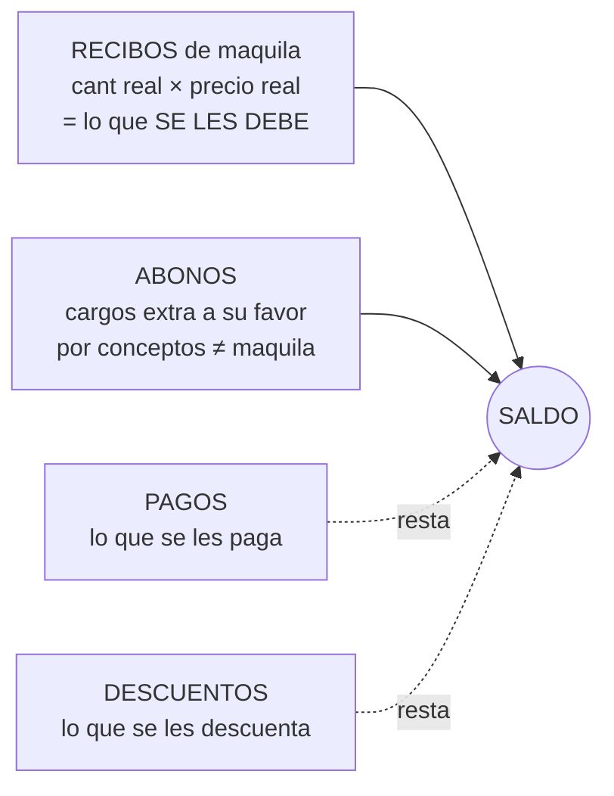

# 07 — Estados de Cuenta de Maquileros (EsMa)

> Submenú de **Producción → Administración de Maquileros** (Menú 3.8).
> Es la **cuenta corriente de cada maquilero**: lo que se les debe por su trabajo, lo que se les paga, descuentos y cargos extra. Aplica a maquileros de **costura** y de **aplicación/estampado**.

---

## 1. Concepto

Cada maquilero tiene un estado de cuenta tipo **"debe / haber"**. El saldo se arma con **4 conceptos**:



### Fórmula real (de la consulta `EsMa_SaldosMaq`)
```
Importe (cargo) = Σ ( CantRecEsMa × PrecioEsMa )     ← por cada recibo
Saldo maquilero = Σ Importe + Σ Abonos − Σ Pagos − Σ Descuentos
```
*(`ceronulo()` trata los nulos como 0.)*

| Concepto | Efecto en saldo | Qué es |
|---|---|---|
| **Recibos** | **+** (se les debe) | Maquila recibida: cantidad real × precio real |
| **Abonos** | **+** (se les debe) | **Cargos adicionales a su favor** por conceptos distintos a la maquila |
| **Pagos** | **−** | Lo que se les paga |
| **Descuentos** | **−** | Lo que se les descuenta |

---

## 2. Flujo de captura (regla de negocio clave)

> Esta es la mecánica que sigue el administrador (descrita por el dueño):

1. El maquilero entrega y su producción se registra en el **almacén de recibo** (tabla `Recibos`, ver [03 — Producción §5](03-Produccion.md)). **Ellos** meten esa información.
2. El **administrador vuelve a capturar** en EsMa la **información real** y el **precio real**, **tomando como referencia** el precio del recibo de maquila. → Es un **punto de control/validación manual**: el saldo de cuentas se basa en lo que el admin confirma, no directamente en lo que metió el maquilero.
3. En la misma pantalla se registran **Pagos**, **Descuentos** y **Abonos**.

> 🟡 **Oportunidad de mejora:** hoy la información del recibo se **recaptura a mano** en EsMa. En el sistema nuevo puede **ligarse/proponerse automáticamente** desde el recibo (con el admin solo validando/ajustando), evitando doble captura y errores.

---

## 3. Modelo de datos

| Tabla | Rol | Campos clave |
|---|---|---|
| `EsMa` | Movimiento del estado de cuenta (por maquilero y fecha) | `FechaEsMa`, `IdMaquileros`, `ObsEsMa` |
| `EsMa_Recibos` | **Cargos** por maquila recibida | `IdOrdenes`, `CantRecEsMa` (cant real), `PrecioEsMa` (precio real), `EsEstampado`, `RevisionPendiente` |
| `EsMa_Abonos` | Cargos extra a su favor | `AbonoEsMa`, `ObsAbonos` |
| `EsMa_Desc` | Descuentos | `DescuentoEsMa`, `ObsDesc` |
| `EsMa_Pagos` | Pagos realizados | `PagoEsMa`, `ObsPagos`, `RevisionPendienteP` |

- **Tipo de maquilero:** en `Maquileros`, los campos `Costura` y `Proceso` indican si es de **costura** y/o de **aplicación/proceso** (estampado). La pantalla filtra por tipo (`QueTipoMaq`).
- **`EsEstampado`** distingue los recibos de estampado/aplicación de los de costura.
- **`RevisionPendiente` / `RevisionPendienteP`:** banderas de partidas **pendientes de revisión** (recibos y pagos).

---

## 4. Las pantallas (Menú 3.8)

| Opción | Formulario | Qué hace |
|---|---|---|
| Directorio de Maquileros | `Maquileros` | Catálogo (datos, tipo, condiciones de pago) |
| **Estado de Cuenta** | `EsMa_EdoCta` | Pantalla principal: elige maquilero y tipo; ver/agregar **Recibos, Abonos, Descuentos, Pagos** |
| Ver Saldos de Maquileros | `EsMa_SaldosMaq` | Saldo de todos (con la fórmula de arriba) |
| Ver Pagos Semanales | `EsMa_PagosSem` | Pagos por semana |
| Recibo de Maquilas Semanal | `RecibosSemanalesMaq` | Recibos de la semana |

La pantalla `EsMa_EdoCta` es de las más completas del sistema (abre 13 formularios): tiene botones **Agregar** y **Abrir** para cada uno de los 4 conceptos, además de copiar partidas y ver existencias del maquilero.

---

## 5. Cómo conecta con el resto del sistema

- **← Producción:** los **recibos** de maquila (`Recibos`) son la base de los cargos; el admin los confirma en `EsMa_Recibos`.
- **← Órdenes:** cada cargo se liga a una orden (`IdOrdenes`) → permite costo de maquila por orden.
- **→ Costos:** el precio real de maquila pagado aquí debería ser consistente con `Ordenes.MaquilaOrd` / `CostoOrd.MaquilaCost`.
- **Maquileros de costura vs aplicación:** ambos llevan su estado de cuenta en el mismo módulo.

---

## 6. Observaciones para la modernización

1. **Doble captura recibo → EsMa.** Ligar automáticamente el cargo al recibo (con validación del admin), en lugar de recapturar cantidad y precio a mano. 🟡
2. **Saldo = suma de movimientos** (igual principio que inventario, D3): el saldo nunca debe ser un campo editable, siempre calculado. ✅ ya funciona así vía consulta — mantener.
3. **Banderas de "revisión pendiente"** → flujo de aprobación/conciliación explícito (estados: capturado → revisado → pagado). 🟡
4. **Consistencia de precio de maquila** entre EsMa, la orden y el costeo: hoy se captura por separado; unificar la fuente del precio de maquila. 🟡
5. **Conservar:** la separación clara de los 4 conceptos (recibos/abonos/pagos/descuentos) y el manejo de costura vs aplicación es un buen diseño.

---

*Siguiente: [08 — Ruta Crítica (RC) y Control de Calidad (CC)](08-RC-y-CC.md).*
