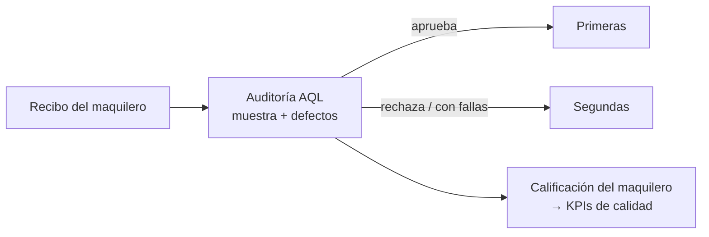

# 09 — Control de Calidad (CC)

> Hoy es submódulo de **Producción** (menú 3.7). Auditoría de calidad de lo que entregan los maquileros.
>
> ⚠️ **Su ubicación como módulo está pendiente de definir en el desarrollo (DECISIÓN D8).** Se relaciona con el **recibo del maquilero**, con su **estado de cuenta ([07 — EsMa](07-EsMa-Estados-de-Cuenta-Maquileros.md))** y posiblemente con la **Ruta Crítica** (como un proceso más). Por ahora se documenta como tema independiente.

---

## 1. Para qué sirve

Cuando un maquilero entrega producción, se le hace una **auditoría de calidad por muestreo** para decidir si se acepta, y para clasificar las prendas en **Primeras** (calidad buena) y **Segundas**. Usa el método **AQL** (Acceptable Quality Level / Nivel de Calidad Aceptable): se inspecciona una **muestra** y se cuentan los **defectos** por tipo; si superan el límite AQL, se rechaza.

---

## 2. Modelo de datos

| Tabla | Rol | Campos clave |
|---|---|---|
| `CC_Catalogo` | Catálogo de defectos/puntos a revisar | `Clave`, `Descripcion`, `Pag`, **`AQL`** (nivel aceptable), `Favorito` |
| `CC_Auditorias` | Encabezado de la auditoría | `NumAuditoria`, `IdOrdenes`, `FechaAuditoria`, `IdMaquilero`, `IdUsuariosElaboro`, `IdUsuariosAuditor`, **`TamanoMuestra`**, **`Resultado`**, `TipoAuditoria`, `Cancelada` |
| `CC_AuditoriasDet` | Defectos encontrados | `IdCC_Catalogo` (qué defecto), **`NumFallas`** (cuántas fallas) |

**Lógica:** se define el `TamanoMuestra`, se cuentan las `NumFallas` por cada tipo de defecto del catálogo, y comparando contra el `AQL` se determina el `Resultado` (aprobada / rechazada). Se registra **quién elaboró** y **quién auditó** (doble responsable).

---

## 3. Pantallas (Menú 3.7.1)

| Opción | Formulario |
|---|---|
| Alta de auditorías | `CC_AltaAuditorias` |
| Capturar auditorías (detalle) | `CC_MeterAuditorias` / `CC_MeterAuditoriasDet` |
| Consultar e imprimir auditorías | `CC_ConsultaAuditorias` |
| Consultar auditorías por maquilero | `CC_ConsulAuditMaq` |

---

## 4. Cómo conecta con el resto del sistema

- **← Recibo del maquilero:** la auditoría se hace sobre lo recibido (`Recibos` / orden de producción).
- **→ Primeras / Segundas:** el resultado clasifica la producción (que en inventario PT son **almacenes** distintos, ver [04 — Inventarios](04-Inventarios.md)).
- **→ EsMa / Maquileros:** la calidad del maquilero alimenta su evaluación (liga con [07 — EsMa](07-EsMa-Estados-de-Cuenta-Maquileros.md)).
- **¿→ RC?:** posible integración como un proceso de la ruta crítica (pendiente, D8).

---

## 5. Observaciones para la modernización

1. **Ubicación a definir (D8):** ¿módulo independiente, parte de Maquileros/Recepción, o proceso de la RC? — decisión de desarrollo.
2. **AQL como parámetro configurable:** mantener el muestreo por AQL pero con tablas/niveles parametrizables (por cliente, por tipo de producto). 🟡
3. **KPIs de calidad por maquilero:** % de aprobación, defectos más frecuentes, tendencia por maquilero/temporada. Se conecta con los KPIs de la RC (D11). 🟡
4. **Catálogo de defectos configurable** (ya existe `CC_Catalogo`): conservar y enriquecer (categorías, severidad). 🟢
5. Conservar: doble responsable (elabora/audita), muestreo, y la liga con Primeras/Segundas.

---

*Con esto quedan documentados todos los módulos funcionales. Pendiente: [10 — Modelo de Datos completo + Usuarios y Permisos](10-Modelo-Datos-y-Usuarios.md).*
