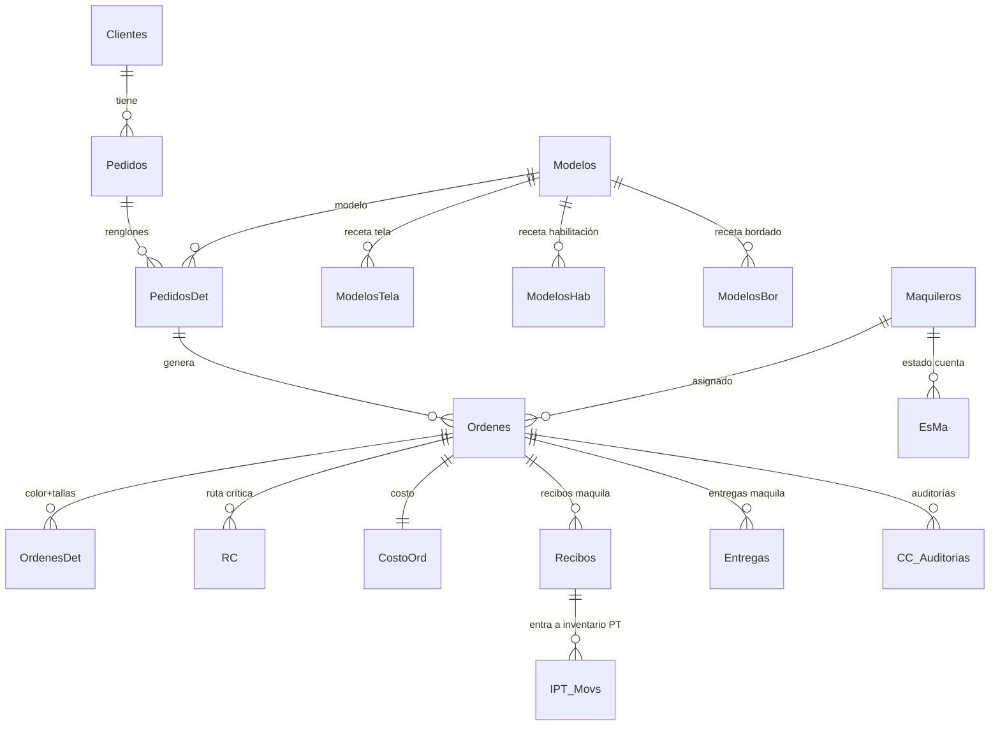

# 10 — Modelo de Datos completo + Usuarios y Permisos

> Documento técnico que amarra todas las tablas, sus relaciones y el esquema de seguridad. Es la **base para el diseño de la base de datos del sistema nuevo**.
> El detalle de cada tabla está en el documento de su módulo (01–09); aquí se ve el **panorama y las relaciones**.

---

## 1. Arquitectura física actual

| Archivo (.mdb) | Contenido | Tablas |
|---|---|---|
| `CONTROL_S_MJD.mdb` | **Front-end**: formularios, código, consultas, y tablas locales (menú, accesos) | — |
| `MJD_Taine.mdb` | Núcleo del ERP (pedidos, órdenes, RC, costos, EsMa, CC, IPT…) | 74 |
| `MJD_Nauc.mdb` | Telas, corte, inventarios, IPT | 33 |
| `MJD_Prop.mdb` | Usuarios, permisos, propiedades | 6 |
| `MJD_Excel.mdb` | Exportación de órdenes de compra | 1 |

> En CONTROL v2 esto será **una sola base de datos** (servidor) con respaldos automáticos (ver MEJORAS A8).

---

## 2. La columna vertebral (cadena productiva)

---

## 3. Entidades por módulo (tablas y llaves)

### Catálogos base
`Clientes`, `Modelos`, `Maquileros`, `Cortadores`, `Estampadores`, `Proveedores`, `TelasDis`, `Habilitacion`, `Bordados`, `Temporadas`, `EtiquetasM`, `Empresas`.

### MODELOS (receta / BOM)
- `Modelos` → `ModelosTela` (→`TelasDis`), `ModelosHab` (→`Habilitacion`), `ModelosBor` (→`Bordados`). Banderas `bPreCosto/bProduccion/bCosto`.

### PEDIDOS
- `Pedidos` (→`Clientes`,`Empresas`) → `PedidosDet` (→`Modelos`).
- `PedidosReales` (→`Pedidos`) → `PedidosRealesDet` (→`PedidosDet`).

### PRODUCCIÓN
- `Ordenes` (→`PedidosDet`,`Modelos`,`Maquileros`,`EtiquetasM`,`Clientes`,`TelasDis`) → `OrdenesDet` (color + `T1..T8`).
- Corte: `OrdenesDetCorte` (→`Corte`/`Cortadores`).
- Maquila **costura (M)**: `Entregas`+`OrdenesDetEntM`, `Recibos`+`OrdenesDetRecM`.
- Maquila **estampado/aplicación (A)**: `EntregasEst`+`OrdenesDetEntA`, `RecibosEst`+`OrdenesDetRecA`.
- **WIP / avance:** form `Proceso` (consolida corte/envíos/recibos + pendientes; no es tabla, es vista calculada).
- Cliente: `EntregasCliente`.
- Notas: `Notas`→`NotasDet` (→`Ordenes`).

### INVENTARIOS
- **PT:** `IPT_Modelos` (→`Ordenes`) · `IPT_Mod_Alm` (→`IPT_Almacenes`, existencia) · `IPT_Movs`→`IPT_MovsDet`. Catálogos `IPT_Generos/TipoProd/TipoPiezas/TiposMov`.
- **Telas:** `Telas`→`TelasColores`→`TelasColAlm` (→`Almacenes`, `ExTela1/2`) · `Entradas`/`EntradasDet` · `Salidas`/`SalidasDet` (→`Ordenes`).

### INDICADORES
- IP: `IP_Personal`, `IP_Actividades`, `IP_Productiv`, `IP_InfConf`, `IP_MuesPend`.
- Almacén: `Alm_Prd`/`Alm_Prd_Act`/`Alm_Prd_Det`, `Alm_5s`, `Alm_InvCic`.

### COSTOS y EDR
- `CostoOrd` (→`Ordenes`). `EdoResult`→`EdoResultDet` (→`CostoOrd`).

### EsMa (cuenta de maquileros)
- `EsMa` (→`Maquileros`) → `EsMa_Recibos` (→`Ordenes`), `EsMa_Abonos`, `EsMa_Desc`, `EsMa_Pagos`.

### RUTA CRÍTICA
- Catálogos: `CP_Familia`, `CP_Articulos`, `CP_Procesos`, `CP_Tiempos`, `CP_Cant`, `RC_TipoTelas`, `RC_Aplicaciones`, `RC_TipoUsuarios`, `RC_ProcUsua`.
- Ruta viva: `RC` (→`Ordenes`,`CP_Procesos`,`CP_Tiempos`), `RC_IP2..5`.

### CONTROL DE CALIDAD
- `CC_Catalogo` · `CC_Auditorias` (→`Ordenes`,`Maquileros`) → `CC_AuditoriasDet` (→`CC_Catalogo`).

> ⚠️ **Nota:** hoy las relaciones se mantienen por **convención** (campos `Id…`), no necesariamente con integridad referencial forzada por el motor (típico en Access/Jet). En CONTROL v2 deben ser **llaves foráneas reales con integridad** (MEJORAS A2).

---

## 4. Seguridad y Usuarios — **dos sistemas conviviendo**

> 🔑 Importante: existen **dos** mecanismos de permisos. El **#2 (Accesos) es el que realmente se usa hoy.**

### Sistema 1 — Niveles en cascada *(el primero, heredado)*
- Campo `Usuarios.Nivel` (1=Admin … 100=el más restringido). Ver [00 — Arranque §2](00-Arranque-Login-y-Menu.md).
- Se usa para: **filtrar el menú** (`Elementos…Nivel >= nivelta()`) y ocultar campos sensibles (precios, totales) según el nivel.
- Es jerárquico: un nivel "ve todo lo de los niveles superiores".

### Sistema 2 — Accesos por usuario (ACL) ✅ **el vigente**
- **`Accesos`** (`IdAccesos`, `Formulario`, `Descripcion`): **catálogo de 38 permisos granulares**, cada uno una capacidad concreta. Ejemplos reales:
  | Id | Permite |
  |---|---|
  | 1 | Ver todos los botones de la RC |
  | 2 | Ver importes totales y precios (en varias consultas) |
  | 3 | Modificar la orden de producción |
  | 4 | Meter/modificar el precio de maquila |
  | 8 | Autorizar órdenes de compra |
  | 10 | Meter fechas con más de 2 días de retraso (RC) |
  | 11–13 | Generar/modificar/actualizar auditorías de calidad |
  | … | (38 en total) |
- **`UsuAccesos`** (`IdUsuarios`, `IdAccesos`, `Activado`): **qué permisos tiene cada usuario** (5,173 registros ≈ 38 × 137 usuarios).
- En el login, el procedimiento `Seguridad` carga estos permisos en el arreglo en memoria **`PrP(50)`**, y cada formulario consulta `PrP(n)` para habilitar/ocultar funciones.
- **Alta de usuario:** al crear un usuario se le insertan todos los accesos (luego se activan/desactivan).

### Tablas de usuarios
| Tabla | Rol |
|---|---|
| `Usuarios` | `Usuario`, `Clave`, `Nombre`, `Nivel`, `CantBloq` (intentos), `Activo`, `IdRC_TipoUsuarios` (rol en RC), `EmpresaFav`, `EsAuditor` |
| `Accesos` / `UsuAccesos` | Permisos (sistema 2) |
| `RC_TipoUsuarios` | Roles/tipos de usuario (usados en la RC para responsables) |
| `UsuariosLog` | Bitácora de entradas/salidas (`FechaEntrada`, `FechaSalida`) |

---

## 5. Tablas transversales

### `Empresas` (multi-empresa)
`Empresa`, `RazonSocial`, `Identificador`, `UPCEmp`, `Importancia` (1 = favorita por defecto), `ParaIPT`, `ParaEdoRes`, `Activa`. Casi todo lo operativo lleva `IdEmpresas`.

### `Propiedades` (parámetros del sistema — un solo registro)
| Campo | Para qué |
|---|---|
| `Empresa` | Nombre |
| `UtilidadSujerida` | Utilidad sugerida (costos) |
| `Regalias` | % de regalías base |
| `VersionDisponible` | Versión disponible (control de actualización) |
| `Mantenimiento` | Bandera de modo mantenimiento |
| `ColchonCostura` | **"Colchón" de días** que se agrega a la costura en la RC |
| `InvFisico` / `InvFisicoPT` | Fechas de inventario físico (telas / PT) |
| `IPT_Almacen_Default` | Almacén PT por defecto |

---

## 6. Observaciones para la modernización

1. **Unificar la seguridad** en un solo modelo moderno: **roles + permisos (RBAC/ACL)**. El sistema 2 (Accesos granulares) es la base correcta; el sistema 1 (niveles) se absorbe como "roles predefinidos". Eliminar la doble lógica. 🔴 (ver MEJORAS A4)
2. **Integridad referencial real** (llaves foráneas, no por convención). 🔴 (A2)
3. **Claves en texto plano:** `Usuarios.Clave` se compara directo en el login. → En v2, **hashing** de contraseñas y manejo de sesión estándar. 🔴
4. **Parámetros del sistema** (`Propiedades`) → tabla de configuración por empresa, parametrizable (incluido `ColchonCostura`, regalías, utilidad sugerida). 🟡
5. **Auditoría/bitácora**: `UsuariosLog` ya existe; extender a un log de cambios por entidad. 🟡
6. **Una sola base de datos** en servidor (hoy 4 archivos .mdb con contraseña y vínculos por ruta). 🔴 (A8)

---

## 🎉 Fin de la fase de documentación

Con este documento quedan cubiertos **todos los módulos funcionales de CONTROL** + el modelo de datos + la seguridad. La documentación vive en `Documentacion_MJD/` y las decisiones/mejoras en `DECISIONES.md` y `MEJORAS.md`.

**Pendiente siguiente (a petición del dueño):** capturar los **requisitos nuevos** — cosas indispensables que el sistema actual nunca tuvo y que se quieren incluir en CONTROL v2. → Ver [REQUISITOS-NUEVOS.md](REQUISITOS-NUEVOS.md).
