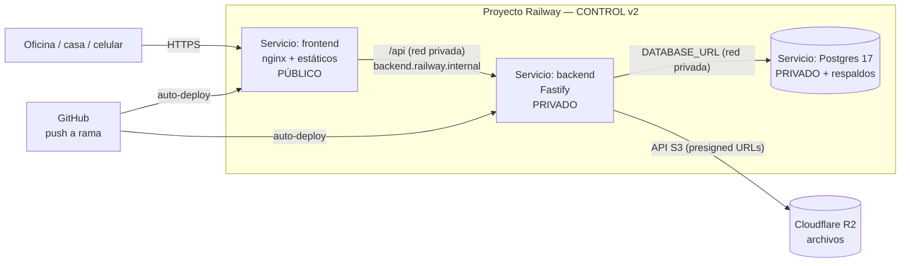
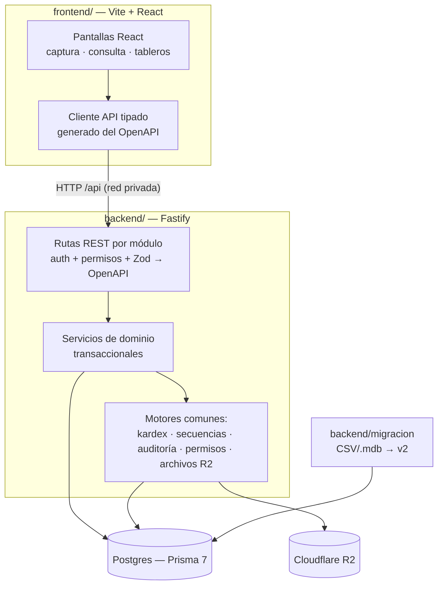
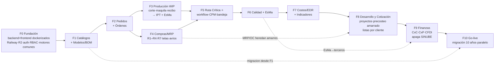

# PLAN MAESTRO — CONTROL v2 (ERP textil Marilyn / MJD)

## Contexto

CONTROL es el ERP que Daniel construyó hace ~30 años en Access 97 y que hoy opera todo el negocio textil de FR Moda. La fase de ingeniería inversa está **completa y validada por Daniel**: 292 formularios, 161 consultas y 116 tablas documentados en `Documentacion_MJD/` (11 docs de módulos + DECISIONES D0–D12 + MEJORAS A1–A10 + REQUISITOS R1–R15). Este plan define **cómo se construye el sistema nuevo**: tecnología, infraestructura, estructura de código, modelo de datos, fases, migración y metodología de calidad. Es el plan que se va a ejecutar — el negocio depende de él.

> ⚠️ **Principio fundamental:** el sistema viejo es **solo referencia de la lógica del negocio (el QUÉ)**, NO de cómo se programa (el CÓMO). El flujo de negocio está validado; el modelo de datos y la arquitectura se diseñan y construyen **100 % nuevos**, con librerías actuales (verificadas a junio 2026), corrigiendo de raíz las limitaciones del sistema viejo (Access 97). Nada improvisado, nada "volando", **sin parches**.

**Decisiones de arquitectura (tomadas por Gabriel, dueño de la ejecución):**
- **Backend y frontend SEPARADOS**, cada uno en su carpeta, desplegados como **servicios independientes**. **No es un monorepo** — nada de workspaces ni herramientas compartidas que escondan lo que pasa.
- **Todo dockerizado.** Cada servicio con su `Dockerfile`; un `docker-compose.yml` levanta el sistema completo con un comando. Objetivo explícito: **portabilidad total** — si Railway se cae, el sistema se levanta en cualquier otro proveedor (otro PaaS, un VPS, una máquina) en minutos, sin reescribir nada.
- **Comunicación por API REST con contrato OpenAPI.** El backend publica un "menú" (OpenAPI) generado desde su propio código; el frontend genera su cliente tipado desde ese menú. Tipado seguro de punta a punta **sin** acoplar los dos lados — servicios de verdad independientes.
- **Infraestructura:** despliegue en **Railway** (servicios conectados por red privada) y archivos en **Cloudflare R2**.
- **Acceso:** oficina + remoto + celular (responsive; captura en PC, consultas/tableros/autorizaciones también en móvil).
- **Migración:** catálogos completos + **mínimo 10 años de historial** de movimientos.
- **Calidad:** sin atajos ni "fixes" posteriores. Todo el código pasa por un equipo de agentes con **mínimo 1 coder + 1 reviewer independiente**, tests obligatorios, código documentado, y los principios A1–A8 son ley.

---

## 1. Stack tecnológico (versiones verificadas a junio 2026)

Dos aplicaciones autónomas (`backend/` y `frontend/`), cada una con su propio `package.json` y su gestor de paquetes **npm** (universal, sin capas mágicas — lo que se ve es lo que hay). Lenguaje único: **TypeScript estricto** en ambos lados.

### Backend — servicio de API (`backend/`)

| Capa | Tecnología (versión) | Por qué |
|---|---|---|
| Runtime | **Node 22 LTS** + **TypeScript 5 estricto** | Maduro, portable, un solo lenguaje en todo el proyecto |
| Framework HTTP | **Fastify 5.8** | Servidor REST rápido, probado en producción, ecosistema sólido |
| Contrato/API | **OpenAPI 3.1** vía `fastify-type-provider-zod 6.1` + `@fastify/swagger 9.7` | El "menú" del backend se **genera desde el código** (los mismos Zod que validan), nunca se escribe a mano ni se desactualiza; navegable como página web |
| Validación | **Zod 4.4** | Una sola definición de cada regla de captura; alimenta validación **y** OpenAPI |
| Base de datos | **PostgreSQL 17** | Transacciones, integridad referencial, secuencias (A2/A3/A8) |
| ORM | **Prisma 7.8** (driver adapter `@prisma/adapter-pg`) + SQL crudo para reportes/KPIs pesados | Migraciones versionadas, esquema como código |
| Auth | **better-auth 1.6** (integración oficial Fastify) + RBAC propio en BD | Reemplaza los 2 sistemas de seguridad actuales (A4); passwords con hash (scrypt de `better-auth/crypto`) |
| Archivos | **Cloudflare R2** vía `@aws-sdk/client-s3 3.1` (API S3, presigned URLs) | Fotos de modelos, adjuntos R6, fichas R5; cero costo de egreso; elimina rutas `S:\` (A5) |
| Trabajos en segundo plano | **pg-boss 12** (cola sobre el mismo Postgres) | Recálculo de CPM, KPIs, PDFs, respaldos — sin infraestructura extra |
| Impresos | **`@react-pdf/renderer 4`** (PDF en el servidor) | R9: cada documento es un componente versionado; sin Chromium en el servidor |
| Exportación | **exceljs** | Reemplaza el viejo `MJD_Excel.mdb` |
| Logs | **pino 10** | Logs estructurados, estándar en Node |
| Tests | **Vitest 4** + Postgres efímero (**testcontainers**) | Nada se mergea sin tests en verde |

### Frontend — la aplicación del usuario (`frontend/`)

| Capa | Tecnología (versión) | Por qué |
|---|---|---|
| Build / runtime | **Vite 8** + **React 19** + **TypeScript 5 estricto** | SPA ligera; build a estáticos; imagen Docker mínima; arranca al instante |
| Ruteo | **react-router-dom 7.17** | Navegación del lado del cliente |
| UI | **Tailwind CSS v4** + **shadcn/ui** + **TanStack Table/Query v5** | Grids de captura tipo ERP, componentes consistentes, responsive (PC + móvil) |
| Cliente del API | **openapi-typescript 7.13** + **openapi-fetch 0.17** | Genera el cliente **tipado** desde el OpenAPI del backend → si el backend cambia el contrato, el front lo marca en compilación |
| Servidor web (producción) | **nginx** (en Docker) | Sirve los estáticos **y** hace reverse-proxy de `/api` al backend por la red privada |
| Tests | **Vitest 4** + **Playwright 1.60** (E2E) | Flujos críticos probados de punta a punta |

Idioma: **UI 100 % en español**; entidades de dominio en español (`Modelo`, `Orden`, `Maquilero`…); infraestructura con convenciones estándar.

Regla de versiones: al iniciar cada fase se instala **la última versión estable** de cada dependencia; `renovate` mantiene los lockfiles al día con PRs revisadas como cualquier otra.

---

## 2. Infraestructura: Docker + Railway + Cloudflare R2 (investigado)

### 2.1 Docker primero (portabilidad por diseño)

Cada servicio se construye como una **imagen Docker estándar**, sin nada específico de Railway:

- `backend/Dockerfile` — build multi-stage: compila TypeScript → imagen Node slim que corre el servidor. Escucha en `::` (IPv4+IPv6) para funcionar en cualquier red.
- `frontend/Dockerfile` — build multi-stage: Vite compila a estáticos → imagen **nginx** que los sirve y hace de reverse-proxy a `/api`.
- `docker-compose.yml` (raíz) — levanta **todo el sistema** local con un comando: `postgres` + `backend` + `frontend`. **El entorno local es idéntico al de producción.**

> 🔑 **Consecuencia:** desplegar en Railway, en otro PaaS, en un VPS con `docker compose up`, o en la máquina de un desarrollador es **el mismo artefacto**. Railway es el proveedor elegido hoy, no una dependencia.

### 2.2 Cómo se conecta en Railway

Un **proyecto** con **tres servicios** que se comunican por **red privada** (DNS interno `*.railway.internal`, cifrado WireGuard, sin exponer puertos):



- **Solo el frontend es público.** El backend y la base de datos viven en la red privada — no se exponen a internet. El navegador habla con el frontend; el nginx del frontend reenvía `/api` al backend por `backend.railway.internal`. Sin CORS, sin URLs quemadas (mover de proveedor = una línea de nginx).
- **Detalle técnico (verificado):** el backend debe escuchar en `::` (dual-stack) — requisito de la red privada de Railway. El frontend (nginx) resuelve el nombre interno del backend.
- **Base de datos:** Postgres es un **servicio gestionado aparte**, que se agrega del catálogo de Railway (NO se construye con un `Dockerfile` propio); trae volumen persistente y respaldos automáticos, y genera la `DATABASE_URL` privada. En **local**, el `docker-compose` levanta un `postgres:17` en contenedor. El backend se conecta **igual por `DATABASE_URL`** en ambos casos → es indiferente dónde viva la BD (gestionada en Railway, en contenedor, o en otro proveedor). Eso es lo que hace portátil al sistema.
- **Respaldo doble (el negocio depende de esta BD):** además de los backups de Railway, un job de pg-boss hace `pg_dump` diario y lo sube **cifrado a R2**. Se prueba la restauración periódicamente.
- **Cada servicio desde el repo:** Railway se conecta al repo de GitHub; cada servicio tiene su **Root Directory** (`backend/` o `frontend/`) y construye desde su `Dockerfile`. Las migraciones de Prisma corren en el **pre-deploy** del backend (`prisma migrate deploy`).
- **Config as code:** `backend/railway.json` y `frontend/railway.json` versionados (build por Dockerfile, healthcheck, restart policy). Lo definido en código manda sobre el dashboard.
- **Ambientes:** dos environments persistentes — **`prueba`** (auto-deploy desde la rama `prueba`) y **`production`** (auto-deploy desde `main`), cada uno con su BD, sus variables y su bucket R2 (`control-v2-prueba` / `control-v2-prod`).

### 2.3 Cómo funciona Cloudflare R2

- Almacenamiento de objetos **compatible con S3**: SDK `@aws-sdk/client-s3` apuntando a `https://<ACCOUNT_ID>.r2.cloudflarestorage.com`, credenciales en variables del backend.
- **Subidas/descargas con presigned URLs:** el backend firma una URL temporal y el navegador sube/baja el archivo **directo a R2** (la app no carga con los bytes).
- **Cero costo de egreso.** Llaves ordenadas por dominio: `modelos/{id}/foto.jpg`, `ordenes/{id}/adjuntos/...`, referenciadas en la tabla `Archivo` (nunca por convención de nombre, A5).

### 2.4 Flujo de trabajo (innegociable)

```
rama de tarea ──PR──▶ prueba (deploy automático en Railway, ambiente de prueba)
                         │  se verifica TODO funcionando en vivo
                         ▼
                       PR ──▶ main (deploy automático en Railway, producción)
```

1. Todo cambio nace en una **rama de tarea** (nunca directo a `prueba` ni a `main`).
2. PR de la rama → **`prueba`**: pasa CI + review del agente reviewer; al mergear, Railway despliega prueba.
3. En prueba se **verifica en vivo** (E2E + revisión de Gabriel) — también se puede levantar local con `docker compose up`.
4. Solo cuando está comprobado: PR de `prueba` → **`main`** → producción.

---

## 3. Arquitectura y estructura del código

Principio rector (A1): **la lógica de negocio vive en el backend (`dominio`), jamás en las rutas ni en el frontend**. Las rutas REST validan (Zod), autorizan (permisos) y **delegan** al dominio en transacciones. El frontend solo presenta y llama al API.



### Estructura del repositorio (todo ordenado, nada suelto)

```
<repo>/
├── backend/                          # SERVICIO 1 — API (Node + Fastify)
│   ├── src/
│   │   ├── servidor.ts               # arranca Fastify, escucha en ::
│   │   ├── api/                      # 1 router REST por módulo (delgado: valida, autoriza, delega)
│   │   │   ├── modelos/ pedidos/ produccion/ compras/ inventarios/
│   │   │   ├── ruta-critica/ calidad/ esma/ costos/ indicadores/
│   │   │   └── catalogos/ documental/ admin/ salud/
│   │   ├── dominio/                  # ★ LA LÓGICA DE NEGOCIO (servicios transaccionales)
│   │   │   └── (un módulo por carpeta, con sus tests *.test.ts al lado)
│   │   ├── comun/                    # motores: kardex, secuencias, auditoría, permisos, archivos R2, errores
│   │   ├── auth/                     # better-auth + RBAC
│   │   ├── datos/                    # cliente Prisma (singleton) + tipos
│   │   └── contrato/                 # esquemas Zod + catálogo de permisos (fuente del OpenAPI)
│   ├── prisma/                       # schema (por dominios) + migraciones + seed
│   ├── migracion/                    # ETL desde TABLAS/*.csv y .mdb (latin-1) → Postgres
│   ├── tests/                        # integración + e2e de API
│   ├── Dockerfile · railway.json · package.json
│   └── openapi.json                  # contrato generado (versionado)
├── frontend/                         # SERVICIO 2 — la app del usuario (Vite + React)
│   ├── src/
│   │   ├── paginas/                  # una por ruta: login + (sistema)/<módulo>
│   │   ├── componentes/              # grids, formularios, matriz color×talla, semáforos, layout
│   │   ├── api/                      # cliente generado del OpenAPI + hooks TanStack Query
│   │   └── main.tsx
│   ├── nginx.conf                    # sirve estáticos + reverse-proxy /api → backend
│   ├── Dockerfile · railway.json · package.json
├── docker-compose.yml                # postgres + backend + frontend (dev local = prod)
├── docs/                             # documentación viva del proyecto (ver §8)
│   ├── arquitectura/                 # ADRs, diagramas, modelo de datos
│   └── modulos/                      # cómo quedó construido cada módulo (al cerrarlo)
├── PLANMAESTRO.md
├── Documentacion_MJD/                # fuente de verdad del negocio (validada — no se copia, se referencia)
└── Respaldo CLAUDE/                  # volcado del sistema viejo + TABLAS/*.csv (datos reales, latin-1)
```

**Regla de oro por módulo:** ruta REST delgada → servicio en `dominio` (transaccional, testeado, documentado) → Prisma. Ningún `INSERT/UPDATE` desde una ruta, nunca. El frontend nunca tiene lógica de negocio: pide al API y muestra.

**El contrato (OpenAPI) es la única cosa compartida** entre backend y frontend. El backend lo genera desde sus Zod; el frontend corre un script que regenera su cliente tipado. Si el contrato cambia, el front lo detecta en compilación. Así los dos servicios son independientes (no monorepo) pero siguen tipados de punta a punta.

---

## 4. Modelo de datos (diseño base — validado)

Base: doc `10-Modelo-Datos-y-Usuarios.md` + decisiones, **rediseñado desde cero** (D0): el modelo viejo dice QUÉ datos maneja el negocio, no CÓMO se modelan. Reglas globales:

- **Llaves foráneas reales** con integridad referencial (A2) en todas las relaciones de dominio (`onDelete Restrict`). IDs autoincrementales; folios de negocio (pedido, orden, nota, OC) con **secuencias de Postgres por empresa** (A3) — nunca `Max()+1`. (Los campos de auditoría `*PorId` son metadatos transversales sin FK física — ver ADR; el único escritor es el dominio y los usuarios nunca se borran.)
- **Borrado suave** en lo operativo (`activo`, `canceladoEn`, `canceladoPor`) — patrón conservado del sistema viejo.
- **Auditoría uniforme** (A7): `creadoPor/creadoEn/modificadoPor/modificadoEn` en toda tabla + tabla `Bitacora` de cambios para lo crítico (órdenes, inventario, RC, EsMa, OC).
- **Multi-empresa explícito** (A9): `idEmpresa` en lo operativo; empresa activa en sesión.
- **Existencias = suma de movimientos** (D3): ninguna existencia editable; saldos derivados del kardex (vistas materializadas donde haga falta).

### Estructuras nuevas clave

**Tallas ilimitadas (D4)** — patrón único para TODA etapa:
```
Talla(id, etiqueta, orden) · CurvaTalla(id, nombre) · CurvaTallaItem(idCurva, idTalla)
OrdenLinea(id, idOrden, idColor)                  -- reemplaza T1..T8
OrdenLineaTalla(idOrdenLinea, idTalla, cantidad)
EtapaMovimiento(id, idOrden, tipo, fecha, idTercero)      -- corte|envio_costura|recibo_costura|envio_estampado|recibo_estampado|entrega_cliente
EtapaMovimientoDet(idEtapaMov, idColor, idTalla, cantidad) -- SIEMPRE color × talla
```

**Maquila unificada:** los flujos M (costura) y A (estampado) se modelan como **un solo proceso de maquila** parametrizado por `TipoProceso` (costura/estampado/bordado/lavado…) — cada tipo se liga a un proceso de la RC.

**Motor de inventario único (D3)** — un kardex para PT, telas y avíos:
```
Almacen(id, nombre, tipo)
Movimiento(id, tipoMov, fecha, idAlmacen, referencia → orden/OC/nota/ajuste, usuario)
MovimientoDet(idMovimiento, idArticulo, …dimensiones…, cantidad, costoUnit)
  • PT:    idModelo × idColor × idTalla                       (D4)
  • Tela:  idTela × idLote   — Lote(id, proveedor, factura, idColor) + LoteComponente(idLote, idTela): N acompañantes por lote (D5)
  • Avío:  idAvio (× idLote si aplica); marca esGenerico para los pocos de stock (R4)
Existencia = vista (SUM por dimensiones × almacén)
```

**Campos de referencia por cliente (D7):** `ClienteCampo(idCliente, etiqueta, tipo, orden)` + `OrdenReferencia(idOrden, idClienteCampo, valor)` indexado para búsqueda global. `Monarch` migra como "No. de pedido del cliente".

**Ruta Crítica como workflow configurable (D10/D11):**
```
ProcesoDef(id, nombre, responsableRol, duracionRegla, aplicabilidadRegla, esCheckpoint)
ProcesoDep(idProceso, idAntecesor)                 -- grafo de dependencias (DAG)
PlantillaRuta(id, nombre) + PlantillaRutaProceso   -- rutas por familia/tipo de artículo
RutaOrden(idOrden, idProcesoDef, fechaPlaneada, fechaReal, idResponsable, estado)
```
CPM recalcula fechas al cambiar tiempos/dependencias; eventos del sistema (recepción de material R7, recibo de maquila, corte) **auto-completan procesos**. Los KPIs (D11) se derivan de `RutaOrden`.

**BOM completo en el modelo (R2):** `ModeloTela`, `ModeloAvio` (consumo por prenda, desde catálogo R1 con N proveedores/precios: `AvioProveedor`), `ModeloBordado`; banderas con nombres claros (`paraPreCosto/paraProduccion/paraCosto`).

**Seguridad (A4):** un solo sistema RBAC: `Usuario`, `Rol`, `Permiso` (catálogo en código; arranca con los 38 accesos actuales + nuevos), `RolPermiso`, `UsuarioRol`. Los "niveles" se absorben como roles predefinidos. Passwords con scrypt, bloqueo por intentos, sesiones estándar, log de accesos.

**Costos (D1/D2):** valuación siempre a **costo actual**; estructura única para pre-costo y costo real (misma fórmula, distinto origen de precios); base de prorrateo explícita.

**Cuenta corriente de terceros (R10) — generaliza EsMa (D12):** un solo motor de movimientos por tercero — `saldo = Σ(cargos) − Σ(abonos/pagos)`, nunca editable (consistente con D3) — que sirve a **CxC** (clientes), **CxP** (proveedores) y **EsMa** (maquila). Cada movimiento lleva dos ejes: **origen** (recibo · factura de proveedor · entrada sin factura · nota de crédito · pago · abono) y **naturaleza fiscal** (fiscal con CFDI+IVA / no fiscal); de un solo libro por tercero salen dos vistas (operativa / fiscal para el contador). El **CFDI** (XML+PDF) se guarda en R2 y se concilia sobre el movimiento. Lo construye la fase **F9 (Finanzas)**; detalle en `Documentacion_MJD/PROPUESTA-Finanzas-y-Proveedores.md` y la decisión en D12.

**Proveedor enriquecido (R15) — paralelo a D7:** el catálogo de proveedores deja de ser pobre — `RolProveedor`/`ProveedorRol` (roles multi-valor: maquila, corte, estampado, vende material/avíos, servicios) + grupos de campos **fiscal** (¿factura?, RFC, régimen SAT, uso CFDI, CP, retenciones), **contacto** (email, etc.), **pago** (crédito, moneda, PUE/PPD, datos bancarios) y **operativo** (lead time para el MRP, adjuntos en R2). Es el cimiento de las CxP; se construye en F1 (etapa F1-E1B).

**Desarrollo y cotización por cliente (R16–R20, D13) — la capa previa al pedido:**
```
ClienteDepartamento(idCliente, nombre)                      -- departamentos del cliente (C&A/NIÑOS)
Proyecto(idEmpresa, folio A3, idCliente, idDepartamento, nombre/tema, temporada)   -- 1 cliente + 1 depto; N por depto/temporada
Desarrollo(idProyecto, idModelo, numeroCliente, apagado)    -- modelo con 2 números; estado DERIVADO
TelaProveedor(idTela, idProveedor, precio, ¿porColor?) + TelaProveedorColor(idColor, precio)  -- R17 (espejo de AvioProveedor)
ModeloAvio.consumoPorTalla + ModeloAvioTalla(idTalla, consumo)   -- R18: precosto usa promedio; la compra, la medida exacta
ConceptoCosto(codigo, fijo)                                 -- R19: tela/avíos/maquila fijos + N conceptos como datos
Precosto(idDesarrollo, version, congelado) + PrecostoLinea(concepto, refs de amarre, importe)  -- persistido, versiones INMUTABLES
ClienteFactores(margen, descuentos, regalías, costoVentas) → ListaPrecios(cliente+depto, EstadoLista configurable, factores snapshot)
  + ListaPreciosLinea(idDesarrollo, idPrecosto, precioCalculado, precioAprobado)   -- el dueño aprueba/ajusta modelo por modelo
NegociacionEvento(idListaLinea, precosto ant./nuevo, precio ant./nuevo, acuerdo)   -- re-costeo por versiones, bitácora inmutable
DesarrolloOrden(idDesarrollo, idOrden)                      -- la liga: el registro completo queda pegado a la orden
```
La **regalía queda FUERA del costo** (D2): es factor de la lista. La lista **NO dispara pedidos** (el pedido nace de la OC del cliente); el MRP hereda del desarrollo la tela con proveedor/precio (deja de ser captura manual) y los avíos por medidas por talla. Lo construye la fase **F8 (Desarrollo y Cotización)**; detalle en `Documentacion_MJD/PROPUESTA-Desarrollo-Cotizacion-y-Listas-de-Precios.md` y la decisión en D13.

---

## 5. Módulos del sistema (estructura nueva, D8)

| # | Módulo | Contenido | Origen doc |
|---|---|---|---|
| 1 | **Catálogos** | Clientes (+campos D7), maquileros, proveedores (+roles y campos fiscales/pago R15), cortadores, telas, avíos (R1), bordados, tallas/curvas, colores, almacenes, temporadas, etiquetas | 01/03/04 |
| 2 | **Modelos** | Catálogo + fotos (R2/bucket) + BOM completo (telas, avíos R2, bordados) | 01 |
| 3 | **Pedidos** | Pedido interno (forecast) + Pedido Real (por CEDIS) — modelo se conserva; copiado múltiple en un clic. **+ Importador de pedido del cliente** (nació en el rediseño, jul-2026: plantilla de mapeo Excel por cliente → alta transaccional pedido+OPs+RC; ver R8 de REQUISITOS-NUEVOS — la variante PDF/IA queda futura) | 02 |
| 4 | **Producción** | Órdenes (color×talla D4), corte, maquila unificada, recibos, entregas a cliente, **WIP** (avance + pendientes por etapa) | 03 |
| 5 | **Compras y Materiales (MRP)** | OC con autorización (se conserva), explosión por orden R3 (avíos Y telas, Make-to-Order), recepción con estatus automático R7, notas de salida **estructuradas** que descuentan avíos | 03 + R1–R7 |
| 6 | **Inventarios** | Motor kardex único: PT (modelo×color×talla×almacén), telas (por lote, N componentes D5), avíos (R4); cíclico contra sí mismo (D6) | 04 |
| 7 | **Ruta Crítica** ⭐ | Workflow configurable + CPM + bandeja de tareas por usuario con semáforo + auto-avance por eventos | 08 |
| 8 | **Calidad** | AQL configurable (por cliente/producto), catálogo de defectos con severidad; conectado a la RC | 09 |
| 9 | **EsMa** | Cuenta corriente de maquileros: cargos automáticos desde recibos, abonos, descuentos, pagos | 07 |
| 10 | **Costos y EDR** | Pre-costo/costo real unificados, costo actual (D1), EDR automatizado desde entregas | 06 |
| 11 | **Indicadores** | KPIs derivados de la RC (D11): entregas a tiempo, lead time, cuellos de botella, desempeño por responsable; calidad por maquilero; productividad | 05 |
| 12 | **Documental** | Fichas técnicas estructuradas por orden (R5) + repositorio de adjuntos en R2 (R6) | R5/R6 |
| 13 | **Administración** | Usuarios/roles/permisos, empresas, configuración por empresa (ex-`Propiedades`), bitácora, modo mantenimiento | 00/10 |
| 14 | **Finanzas (cuentas de terceros + CFDI)** | Cuenta corriente única de terceros (CxC + CxP + EsMa) con marca fiscal y dos vistas (operativa/fiscal, R10); importación y conciliación de CFDI de proveedores (R11) y de ventas (R12); notas de crédito; reportes fiscales para el contador (R13). Timbrado vía PAC = sub-entrega posterior (R14). Meta: apagar SINUBE | PROPUESTA-Finanzas + 07 (EsMa) |
| 15 | **Desarrollo y Cotización** | Proyectos de desarrollo por cliente+departamento (R16); precosteo persistido con precios amarrados a proveedor/producto/precio — telas por proveedor y color (R17) —, medidas por talla en ciertos avíos (R18) y conceptos de costo abiertos (R19); listas de precios por cliente+departamento con factores del cliente, aprobación del dueño y negociación por versiones (R20); liga a la orden de producción que alimenta el MRP/OC | PROPUESTA-Desarrollo-Cotización + 01/06 |

**Impresos (R9):** cada documento (orden de producción, nota de salida, OC, recibos de maquila, estado de cuenta, ficha de estampado, auditoría, lista de precios, inventario de telas + nuevos: explosión R3 y estatus R7) se implementa como PDF en el backend (`@react-pdf/renderer`), **dentro de la fase de su módulo**, usando los actuales como referencia.

**Punto de integración central:** el **recibo de maquila** es UN solo servicio transaccional que en una operación actualiza WIP + entrada a inventario PT + cargo en EsMa + auto-avance de la RC. *Capturar una vez, usar en todos lados.*

---

## 6. Fases de desarrollo (orden y dependencias)



| Fase | Entrega | Criterio de salida |
|---|---|---|
| **F0 — Fundación** | Repo con `backend/` y `frontend/` dockerizados; `docker-compose` que levanta todo; **proyecto Railway (frontend+backend+Postgres, ambientes `prueba` y `production`) y buckets R2**; login/RBAC; OpenAPI generándose y cliente del front consumiéndolo; layout responsive con menú por permisos; motores comunes (kardex, secuencias, auditoría, archivos, errores) | `docker compose up` levanta el sistema; app desplegada en Railway; login real; un CRUD patrón completo (Almacenes) end-to-end que fija el estándar |
| **F1 — Catálogos + Modelos** | Módulos 1 y 2 (incl. campos por cliente D7, catálogo de avíos R1, **proveedor enriquecido R15**, BOM R2, fotos en R2) | Un modelo real con su receta completa, capturado en el ambiente de prueba |
| **F2 — Pedidos + Órdenes** | Módulo 3 + órdenes con matriz color×talla ilimitada (D4), referencias del cliente buscables | Un pedido fluye hasta su orden; impreso de orden |
| **F3 — Producción/WIP** | Corte, envíos/recibos de maquila unificada, **servicio transaccional recibo→IPT+EsMa**, WIP, entregas a cliente | Una orden recorre todo el ciclo; inventario PT cuadra por kardex |
| **F4 — Compras/MRP** | Explosión R3, OC desde explosión, recepción R7 con estatus por orden, inventarios de telas (D5) y avíos (R4), notas de salida estructuradas | El tablero "qué tengo/qué falta" reemplaza el drive manual |
| **F5 — Ruta Crítica** | Motor workflow + CPM + plantillas + bandeja con semáforo + auto-avance desde F3/F4 | Una orden corre con su RC y las fechas se llenan solas donde aplica |
| **F6 — Calidad + EsMa** | AQL configurable + estado de cuenta completo (abonos, descuentos, pagos, impresos) | EsMa cuadra contra los recibos del periodo |
| **F7 — Costos/EDR + Indicadores** | Costeo (D1), EDR automatizado, tableros KPI derivados de RC (D11) | Costos y tableros cuadran contra el cálculo manual |
| **F8 — Desarrollo, Cotización y Listas de Precios** | Módulo 15: proyectos por cliente+departamento (R16); precios amarrados — telas por proveedor/color (R17), medidas por talla (R18), conceptos abiertos (R19); precosteo persistido y versionable; listas de precios con factores del cliente + aprobación del dueño + negociación por versiones (R20); liga a la orden que alimenta MRP/OC. Impreso de lista de precios (R9). Sin ETL de Access (D13) | Un desarrollo recorre el ciclo completo: proyecto → precosteo amarrado → lista con factores → aprobación → una ronda de negociación versionada → liga a orden → la explosión sugiere tela con proveedor/precio y compra avíos por medidas por talla |
| **F9 — Finanzas (CxC/CxP + CFDI)** | Módulo 14: cuenta corriente única de terceros (generaliza EsMa, R10) con marca fiscal y dos vistas; CxP y CxC; importación/conciliación de CFDI de proveedores (R11) y de ventas (R12); notas de crédito; reportes para el contador (R13). Sub-entrega posterior: timbrado vía PAC (R14) | CxC y CxP cuadran por suma de movimientos; un CFDI de proveedor y uno de venta importados y conciliados; reporte fiscal para el contador |
| **F10 — Migración + Go-live** | ETL de catálogos + **≥10 años de historial** + saldos; periodo en paralelo con CONTROL viejo; corte final | Saldos v2 = saldos Access en fecha de corte; usuarios operando |

Cada fase incluye: sus pantallas (PC + vista móvil donde aplique), sus impresos, sus tests, su documentación en `docs/modulos/`, su parte del ETL y **verificación funcional en el ambiente de prueba antes de cerrarse**.

---

## 7. Migración de datos (`backend/migracion`)

- Fuente: `Respaldo CLAUDE/TABLAS/*.csv` (latin-1) + `.mdb` vía `access-parser` para refrescar al corte.
- ETL en TypeScript por dominio, **idempotente y re-ejecutable** (se corre muchas veces antes del corte): leer → limpiar/transformar (T1..T8→filas talla, ExTela1/2→LoteComponente, Monarch→OrdenReferencia, M/A→maquila unificada, accesos→roles) → cargar reusando los servicios del dominio (mismas validaciones que la captura real).
- Alcance: catálogos completos + **movimientos de los últimos 10 años** + saldos iniciales al corte. Lo anterior queda en un **archivo histórico de solo lectura** consultable.
- Reporte de cuadre obligatorio por entidad: conteos, sumas de existencias y saldos EsMa v1 vs v2; las inconsistencias de origen se listan para decisión, no se "arreglan" en silencio.

---

## 8. Estándares de documentación y orden ("no quiero cosa volando")

1. **Carpetas con dueño claro:** todo archivo vive en el dominio que le corresponde (§3). Prohibido: utilidades sueltas en raíz, lógica en rutas o en componentes del frontend.
2. **Código documentado:** todo servicio de `dominio` lleva **TSDoc** (qué hace, regla de negocio que aplica, referencia al doc funcional y a la decisión D#/R#/A# que implementa). Zod con descripciones (alimentan el OpenAPI). Comentarios solo donde el código no puede decirlo solo.
3. **README por servicio y por módulo:** qué contiene, cómo se usa, cómo se prueba, cómo se levanta con Docker.
4. **`docs/` viva:** `arquitectura/` (ADRs: cada decisión técnica importante escrita con su porqué — incluido el contrato OpenAPI, la red privada, el hash de passwords, la auditoría sin FK), `modulos/` (cómo quedó construido cada módulo, al cerrarlo). El funcional NO se copia: se **referencia** `Documentacion_MJD/` (ADR-0002).
5. **Convenciones únicas** definidas en F0 (nombres, estructura de servicio, patrón de ruta REST, patrón de pantalla, manejo de errores) y aplicadas por lint + review en todo el proyecto.

---

## 9. Metodología de desarrollo — equipo de agentes y calidad

**Regla innegociable: nada de "fixes" a posteriori; el código se entrega bien a la primera.** Cómo se garantiza:

1. **Equipo mínimo por tarea: 1 agente coder + 1 agente reviewer independiente.** El coder implementa contra la documentación del módulo y este plan; el reviewer (agente distinto, contexto limpio) revisa el diff contra: el doc funcional, las decisiones D#, los estándares §8 y los tests. Si objeta, el coder corrige **antes** del merge. En tareas grandes (motor kardex, CPM, servicio de recibo) se agregan más coders en paralelo y/o un segundo reviewer. **Criterio de paralelización (cuándo varios coders):** se lanzan coders en paralelo solo cuando el trabajo se parte en piezas **independientes** —módulos distintos, archivos sin solape, sin cadena de dependencias— (p. ej. catálogos independientes en F1, o backend vs frontend en una misma fase). Cuando el trabajo es una **cadena de dependencias** sobre archivos/config compartidos (datos → motores → dominio → tests dentro de un mismo servicio, como E2), va **un solo coder**: ahí paralelizar genera esperas (cada coder espera al anterior) e interferencias (conflictos en config compartida, integración frágil) y suele ser más lento. Regla: *paralelizar por independencia, no por urgencia.*
2. **Estándares innegociables** (se verifican en cada review):
   - Lógica solo en `backend/src/dominio`; rutas REST y frontend sin reglas de negocio (A1).
   - Toda operación multi-tabla en **una transacción** (A2). Folios solo por secuencia (A3). Existencias solo por kardex (D3).
   - TypeScript `strict`, Zod en toda entrada del API, permisos verificados en el servidor en cada ruta.
   - **Tests primero en servicios**: cada servicio de `dominio` con tests unitarios + integración contra Postgres efímero; E2E Playwright para flujos críticos (login, pedido→orden, recibo de maquila, explosión).
   - Auditoría, borrado suave y TSDoc en toda entidad/servicio.
   - El **OpenAPI** se regenera y el cliente del frontend queda sincronizado en la misma tarea.
3. **CI bloqueante + flujo de ramas (§2.4):** lint + typecheck + tests + build de imágenes Docker de ambos servicios + migración aplicable en limpio. Rama de tarea → PR a `prueba` (review + CI) → Railway despliega prueba → **verificación en vivo** → PR de `prueba` a `main` → producción.
4. **Verificación funcional:** cada fase cierra con demo en el ambiente de prueba (Railway o `docker compose up` local) con datos reales; Gabriel verifica antes de continuar.

---

## 10. Verificación end-to-end del proyecto

- **Por fase:** criterios de salida de §6 + suite de tests en verde + verificación en el ambiente de prueba.
- **Prueba reina (antes de go-live):** con datos migrados reales, ejecutar el ciclo completo — alta de modelo con BOM → pedido → orden → explosión y OC → recepción (auto-avance RC) → corte → envío/recibo de maquila (IPT + EsMa + WIP en una captura) → auditoría de calidad → entrega a cliente → costo de la orden → KPIs — y cuadrar cada número contra el cálculo manual.
- **Paralelo:** 2–4 semanas operando v1 y v2 a la vez sobre órdenes reales; cuadre diario de inventarios y EsMa antes del corte definitivo.

---

## 11. Riesgos identificados y cómo están cubiertos

| Riesgo | Mitigación en este plan |
|---|---|
| Pérdida de datos (todo el negocio en una BD) | Backups nativos de Railway + `pg_dump` diario cifrado a R2 + pruebas de restauración periódicas |
| Caída o cambio de proveedor (Railway) | **Todo dockerizado y portable**: `docker compose up` levanta el sistema completo en cualquier proveedor o máquina, sin reescribir nada |
| Descuadres de inventario/EsMa al migrar | ETL idempotente + reporte de cuadre obligatorio v1 vs v2 + periodo en paralelo de 2–4 semanas |
| Código que "funciona pero está mal hecho" | Coder + reviewer independiente por tarea, CI bloqueante, estándares §8/§9 verificados en cada PR |
| Backend y frontend que se desincronizan | El contrato **OpenAPI** se regenera en cada cambio; el cliente del frontend es tipado → una incompatibilidad se ve en compilación, no en producción |
| Cálculos pesados (CPM, KPIs) frenando la captura | Cola pg-boss en segundo plano; la captura nunca espera un recálculo |

## 12. Primer paso al ejecutar este plan

Construir el esqueleto de F0 en este repositorio: las carpetas `backend/` (Fastify + Prisma + dominios comunes: empresas, usuarios/RBAC, almacenes, secuencias, bitácora, archivos R2; OpenAPI generándose) y `frontend/` (Vite + React + login + layout responsive + cliente del API), cada una con su **Dockerfile**; el `docker-compose.yml` que levanta todo; el CRUD patrón (Almacenes) end-to-end; el CI; y la configuración de Railway (frontend + backend + Postgres, ambientes `prueba`/`production`) y R2 — y de ahí avanzar fase por fase con el equipo coder+reviewer en cada tarea.
